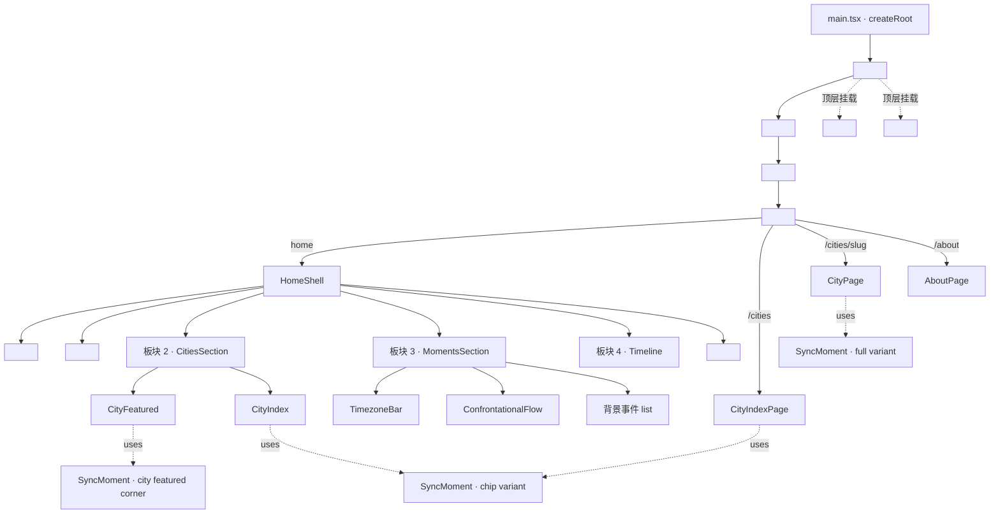
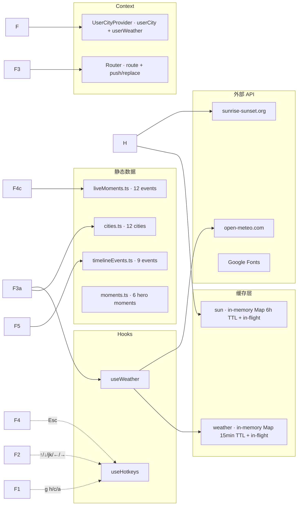
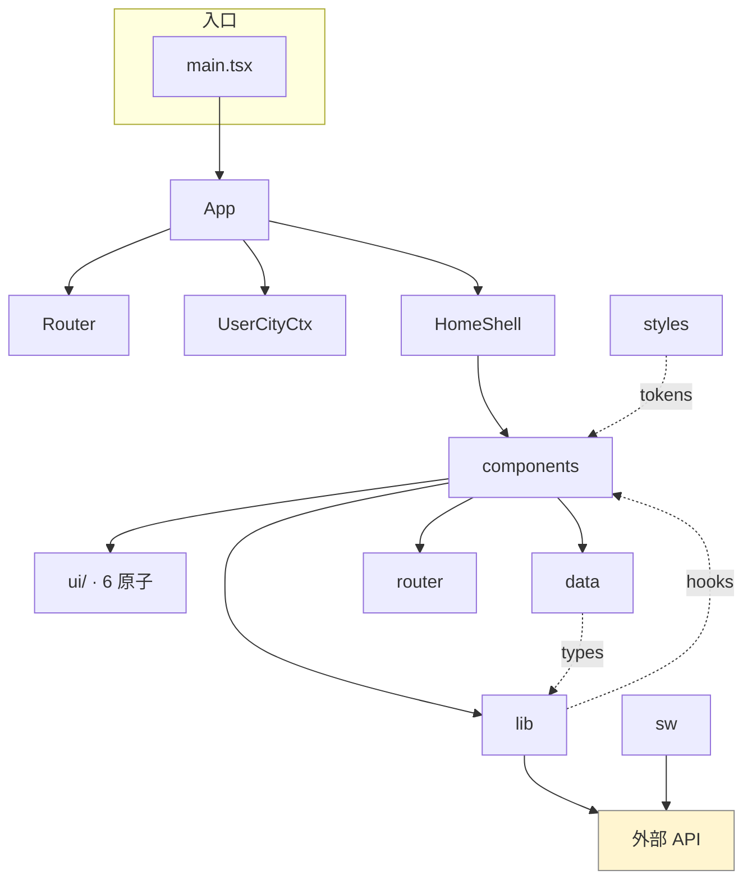

# 「看见地球 / See Earth」 v1.1.0-rc.1 · Production-Ready 审查报告

**审查日期**: 2026-08-18
**分支**: `codex/v1.4-pr29-sync-moment` (HEAD `74cfbe0`)
**审查范围**: 全部源代码 + 构建产物 + Lighthouse 报告 ×3
**审查基线**: Performance 100 · Accessibility 97 · Best Practices 100 · SEO 100（lighthouse-report-1/2/3 median）

---

## 1. TL;DR

### 5 条最关键发现

1. **🔴 a11y · 颜色对比度不达标(WCAG AA fail)** — 板块 2 列表项的"编号"和"英文名"在 active / 默认态低于 4.5:1;Lighthouse 已明确标 0 分。这是**唯一阻塞上线的硬指标**。
2. **🟠 关键 bug · `findCityIdx('newyork')` 永远找不到 city** —— `src/data/cities.ts` 没有 `new-york` slug,首屏"纽约 / 上海 / 伦敦"建议按钮点了无反应。
3. **🟠 关键 bug · `tokens.css` 第 2 个 `:root {` 没闭合** —— 第 335 行开了 `:root {` 后,只有最后一行 `--modal-max-width-lg: 720px;` 后跟一个 `}`。整组 content-type / SearchBox / SyncMoment / Modal 令牌在严格解析器下可能丢失。
4. **🟡 架构债 · `App.tsx.bak` 仍留在 src/** —— gitignore 屏蔽但不删,污染源码树;说明备份习惯散乱。
5. **🟡 上线必备缺失 · 无 ErrorBoundary / 无 fallback / 无埋点** —— 一旦 API 永久失败或代码 throw,白屏且永远查不到。

### 阻塞上线的 P0 数量:**2**(对比度 + 新纽约 slug)

---

## 2. Bug 清单

> 严重度:🔴 阻塞上线 / 数据丢失 / 安全 · 🟠 上线后必须立刻修 · 🟡 后续迭代

| ID | 严重度 | 类别 | 位置 | 描述 | 复现 | 建议修复 |
|----|------|-----|------|------|------|---------|
| B-01 | 🔴 | a11y | `src/components/CityIndex.module.css:79` + `:144` | `.item.active .number { color: var(--color-accent-500); }` (=#B25E40) 落在 `color-mix(... 6% transparent)` 上 = 有效背景 #F0E5DC,对比度 3.7:1(需 4.5)。同样 `.nameEn { color: var(--color-ink-500); opacity: 0.7; }` = 有效颜色 #7F7B74,对比度 3.39:1。 | Lighthouse `color-contrast` 报 score 0;元素选择器 `span._number_*` / `span._nameEn_*`。 | active 态用 `--color-accent-600` 或更深的 `#8B4530`;`.nameEn` 去掉 opacity,直接用 `--color-ink-700`。 |
| B-02 | 🔴 | 业务逻辑 | `src/App.tsx:244-248` + `src/data/cities.ts:486-507` | "纽约 / 上海 / 伦敦"按钮调 `findCityIdx('newyork')` → 走的是 `findCity(slug)` (cities.ts:477),但 `cities` 数组里**没有 `new-york` slug**。`findCityByAnyKey` 里倒是给 'newyork' 写了 alias,但 App.tsx 没走那条路径。 | 首屏 → 点 "纽约 / 上海 / 伦敦" → 主图不变(伦敦正常,但纽约按钮无效)。 | (a) `findCityIdx` 改用 `findCityByAnyKey`;或 (b) `cities.ts` 加 `new-york` 城市(更彻底,12 城改成 13)。 |
| B-03 | 🟠 | 样式/构建 | `src/styles/tokens.css:335` | 第 2 个 `:root {`(sections 18-21)后面没有配对的 `}` —— 直到文件末尾 `--modal-max-width-lg` 之后**才**出现唯一闭合。说明 sections 18 的 `--content-type-*` 等令牌**仍嵌在 `:root` 内**,而 21 modal 也嵌套。这能跑通是侥幸,但 esbuild 历史上已对类似构造发过警告。 | 直接读文件即可见 `bash -c "tail -3 src/styles/tokens.css"`。 | 把 sections 18-21 的所有变量抽到顶层 `:root` 块,删多余嵌套。 |
| B-04 | 🟠 | 业务逻辑 | `src/data/liveMoments.ts:715` + `src/App.tsx:362-368` | `getMixedSnapshot` 声明但从未调用;`onReshuffle` 类型有但 `App.tsx` 没传给 `MomentsTimeline`。板块 3 的 "换一组世界" 按钮**永远不出现**(条件 `onReshuffle &&` 永不成立)。dead code。 | 进入板块 3 → 没有换一组按钮。 | 二选一:(a) 真正接入 reshuffle(配合 `useState` 存抽取结果);(b) 删掉 `getMixedSnapshot` 和 reshuffle 相关 props/types。 |
| B-05 | 🟠 | 错误处理 | `src/main.tsx:15-19` + `src/App.tsx:386-411` | 全 App 没有 `ErrorBoundary`。任何组件 throw(React 18 / SW promise reject / 资源加载异常)→ 整页白屏,用户无任何恢复路径。 | `render={() => { throw new Error('test') }}` 后白屏。 | 包一层根级 ErrorBoundary,降级到"出了点问题,刷新看看" + 重试按钮。 |
| B-06 | 🟠 | a11y/SEO | `src/components/AboutPage.tsx:72` | 关于页写的 GitHub URL 是 `https://github.com/lwy0330/SeTheEarth`(全小写),但 git remote 实际是 `git@github.com:LWY0330/SeTheEarth.git`(LWY 大写)。大小写敏感 → 404。 | 点击页脚链接 → 404。 | 把源码链接改为 `https://github.com/LWY0330/SeTheEarth` 或核实真实仓库。 |
| B-07 | 🟠 | 安全/SEO | `vite.config.ts` | 没有配置 sourcemap 是否生产公开,没有 `build.rollupOptions.output`,没有 `preview.headers`(CSP / X-Frame-Options / Referrer-Policy / X-Content-Type-Options)。SWA 部署到 Vercel 是依赖平台默认 headers,迁移到自托管会裸奔。 | 看 `vite.config.ts` 全文只有 `host: '0.0.0.0'`。 | 加 `preview.headers` / `build.sourcemap: 'hidden'`(只生成 .map 但不挂 URL 引用)。 |
| B-08 | 🟠 | 数据/网络 | `public/sw.js:70` | staleWhileRevalidate 图片策略写了 `'images.unsplash.com' / 'plus.unsplash.com' / 'images.pexels.com'`,但实际项目已在 PR #16 全部改自托管 `/images/cities/...`。所以这个分支**永远不会 hit**(被拦截的回流只来自二次访问旧链接,生产没有)。无功能 bug,但属 dead code + 增加维护认知负担。 | 部署后打开 DevTools → Network,所有图片是同源 `/images/...`,没有任何 `images.unsplash.com` 流量。 | sw.js 改成对**所有 GET 请求走 stale-while-revalidate** + 同源 HTML/JS 走 cache-first。 |
| B-09 | 🟠 | 构建/资源 | `tsconfig.node.json:3-9` | `composite: true` + `noEmit: false` 组合,导致 `npm run build` 必走 `tsc -b`(多项目引用)。V1.1 ROADMAP 已记录这个坑并用 `tsc --noEmit -p tsconfig.json` 绕过 typecheck。`npm run typecheck` 与 `npm run build` 不一致 —— 容易漏掉 emit-only 错误。 | `npm run typecheck` 不跑 `vite.config.ts`;`npm run build` 才跑。 | typecheck 脚本改成 `tsc -b --noEmit`,与 build 对齐;或者拆 tsconfig.node.json 单独跑。 |
| B-10 | 🟡 | 副作用/useEffect | `src/components/CityFeatured.tsx:32-35` 等 8 处 | `setInterval` / `setTimeout` / `addEventListener` 在 `useEffect` 内被注册,cleanup 都写了 ✓。但**没有按 `prefers-reduced-motion` 主动降低 tick 频率**(只在 CSS 层降级 transition)。用户开启 reduce-motion 后,React 仍每秒/每分钟 re-render,浪费 CPU + 触发电池耗电。 | macOS 系统偏好 → 辅助功能 → 显示 → 减弱动态效果 → 打开 → 观察 DevTools Performance:TimeBlock 仍每秒重渲染。 | 加 `useReducedMotion()` hook 或 `window.matchMedia('(prefers-reduced-motion: reduce)').matches` 守卫;reduce 时 setInterval 周期 × 10 或直接暂停。 |
| B-11 | 🟡 | 可访问性 | `src/components/MomentsTimeline.tsx:255-313` | `<ol className={styles.rightList}>` 列表项既是 `<li>` 又有 `role=button` + `tabIndex={onSelectEvent ? 0 : undefined}` —— 当 `onSelectEvent` 存在时,列表项**既是 listitem 又是 button**。这违反 ARIA 规则(元素只能有一个 role),屏幕阅读器可能 announce 两次。 | 用 NVDA / VoiceOver 浏览板块 3 → 听到 "list item · button"。 | 把列表项改成 `<li>` 包含一个嵌套 `<button>`(独立焦点);或在 `<ol>` 外加 `role="list"` 而不是列表项加 `button`。 |
| B-12 | 🟡 | 数据 | `src/data/liveMoments.ts:71-95` 等 | `LiveEvent.observedAt` / `updatedAt` 是 hardcode 到 2026-08-07 的伪"实时"数据,板块 3 顶部还显示 "AUG 2026"。`momentsMeta.status === 'developing'` 表明本来就知道这是占位 —— OK,但应当在 AboutPage / 文档里**主动承认**而非仅靠 status badge。 | 打开页面 → 看到 2026-08-07。 | AboutPage 加一行"事件池是 v1.x 编辑精选快照,真实接入在 v2.x 规划"。 |
| B-13 | 🟡 | 类型/可维护性 | `src/lib/userCity.ts:82` | `return uc as unknown as import('@/data/cities').City;` —— 强制类型断言,把 `UserCity` 5 字段当 City 全字段用。`City` 有 `images`/`description`/`weather` 等必填字段,在 `useWeather` 路径上只读 `slug/lat/lon/timezone` 没问题,但**任何未来新增字段读 `city.images` 都会 undefined**。 | 直接读这行。 | (a) 改 `useWeather` 接收 `{slug,lat,lon,timezone}` 子集;(b) 引入 `UserCity` 在 useWeather 里作为 narrow 类型。 |
| B-14 | 🟡 | 资源管理 | `src/components/WeatherIcon.tsx` / `MomentsTimeline.tsx:281` 等 | 大量 `` 元素**没有 `onError` 兜底**。一旦某张图片 404,React 不会触发重渲染,而是浏览器原生 broken image icon;CityFeatured 的 `key={picked.url}` 重启 fade-in 逻辑依然成立,但用户体验是"图标消失"。 | DevTools → Network → 把一张图改成 404 → 重新载入 → 看到 broken icon。 | 加 `onError={(e) => { e.currentTarget.src = '/images/fallback.webp'; }}`。 |
| B-15 | 🟡 | 可观测性 | 整个 src/ | **没有任何前端埋点 / 错误上报**。open-meteo / sunrise-sunset 失败时 `console.warn` 就完了,Vercel Analytics / Sentry / 自建接口都没有。生产事故全靠用户邮件反馈。 | grep `analytics\|sentry\|track\|report` 全部 0 命中。 | v1.5 加 Sentry(Vite 插件 `@sentry/vite-plugin`);最少加一个全局 `window.addEventListener('error', sendBeacon)` 兜底。 |
| B-16 | 🟡 | 工程化 | 项目根 | **没有 `.editorconfig` / `.nvmrc` / `.eslintrc*` / `.prettierrc*`**。React 18 + TS strict 项目居然没有 lint 工具,意味着 PR 时没有强制 style / a11y / hook lint 规则。 | `ls -la | grep -E 'editor|nvm|eslint|prettier'` 全部 0 命中。 | 加 `.editorconfig` + `eslint` + `eslint-plugin-react-hooks` + `eslint-plugin-jsx-a11y`,CI 必跑。 |
| B-17 | 🟡 | 工程化 | `src/App.tsx.bak` | 备份文件留在 src/,违反 `.gitignore` `*.bak` 规则(故 git 不跟踪),但**本地工作树有污染**。来源是 v1.5 PR 阶段的对比备份。 | `ls src/*.bak` 命中。 | 删除;改用 git branch 而不是 .bak。 |
| B-18 | 🟡 | 可维护性 | `src/styles/tokens.css:378` | 注释"1.4 旧名 alias (PR #16 玻璃阴影系统)"等历史包袱越来越多;`tokens.css` 389 行,2 个 `:root` 块 + 嵌套错位,新人接手成本高。 | 看整文件。 | 拆 `tokens.css` 为 `tokens/colors.css`、`tokens/typography.css`、`tokens/spacing.css` 等,Vite 自动合并。 |
| B-19 | 🟡 | 资源 | `src/components/ui/Modal/Modal.tsx:10` | `Modal` 组件写了但**未被任何业务代码引用**(`grep -r "import.*Modal"` 在 components/ 下只命中 ui/Modal 自己)。HotkeyHelp / UserCityPicker 都没用,Modal 是 v1.5 预留的 dead component。 | grep `from '@/components/ui'` 实际只用了 Button / Tag / Stack / Input。 | 二选一:删 Modal,或把 HotkeyHelp / UserCityPicker 改用 Modal 重写。 |
| B-20 | 🟡 | a11y | `src/components/CityNow.tsx:99` | `
` 包裹整个 CityNow 卡片,**包括时间、数字、图标**。polite 区域每 30 秒会朗读整块内容(因为天气 + dayPeriod 会变),对屏幕阅读器用户是噪音。 | VoiceOver 焦点到 CityNow → 等 30s → 整张卡片朗读。 | aria-live 只包"会变的部分"(weatherRow + dayPeriod),其他用静态 `
`。 |

---

## 3. 架构图

### 3.1 组件树(按渲染层级)

### 3.2 数据流(共享层 / 副作用)

### 3.3 关键依赖关系

---

## 4. 分层说明

### 入口层
- **职责**:挂载根组件 + 启用 StrictMode + 注册 SW。
- **文件**:`src/main.tsx`、`src/App.tsx`、`index.html`、`vite.config.ts`、`tsconfig.json`/`tsconfig.node.json`
- **依赖方向**:一切向下 → React DOM
- **风险**:
  - **B-09**: `tsconfig.node.json` 的 composite + noEmit 让 typecheck 与 build 不一致,容易漏报错。
  - **B-07**: vite.config 没设 sourcemap 策略 / preview headers,迁平台会裸奔。

### 数据层(`src/data/`)
- **职责**:12 城 / 12 事件 / 9 历史时刻 / 20 用户城市的 SSOT;导出纯函数 `getCityNow` / `pickImage` / `getCurrentPeriod` / `findCityByAnyKey`。
- **文件**:`cities.ts`(553 行)· `liveMoments.ts`(769 行)· `moments.ts`(111 行)· `timelineEvents.ts`(116 行)
- **依赖方向**:零运行时依赖(只用 `Intl.DateTimeFormat`);UI 全靠这里。
- **风险**:
  - **B-02**: `findCityIdx('newyork')` 走 `findCity`(没 alias),永远 undefined。`findCityByAnyKey` 有 alias 但 App.tsx 没走这条路。
  - **B-04**: `getMixedSnapshot` declared but never used;属 dead code。
  - **B-12**: hardcode 2026-08-07 "实时"快照,与 `momentsMeta.status='developing'` 状态不一致。

### 状态/逻辑层(`src/hooks/` + `src/lib/`)
- **职责**:共享缓存、跨组件工具、单元测试;无 React 依赖的纯函数 + 1 个 useEffect hook。
- **文件**:`lib/sun.ts` · `lib/weather.ts` · `lib/timeDiff.ts`(有单测)· `lib/imageUrl.ts` · `lib/useWeather.ts` · `lib/userCity.ts` · `lib/editorialLevel.ts` · `lib/weatherCodes.ts` · `hooks/useHotkeys.ts`
- **依赖方向**:只依赖 data 层 + `Intl`/`fetch`;UI 反向消费。
- **风险**:
  - `weather.ts:99-105` 内存缓存无 LRU 也不清空 → 长会话可能累计 12 城 × 多次刷新,内存涨;小问题(每条 < 1KB)。
  - `sun.ts:39-47` 同理,且 `cacheKey` 用 `cityId(实际slug)::dateKey`,OK。
  - **B-13**: `userCity.ts:82` 用了 `as unknown as` 把 `UserCity` 强制当 `City`,是技术债。
  - `hooks/useHotkeys.ts` 写得不错,Esc 优先级 / g+字母 500ms / typing-target 排除都到位。

### 视图层(`src/components/` + `src/App.tsx` 编排)
- **职责**:渲染 + 事件绑定 + 局部 state。所有组件都是函数组件 + hooks。
- **文件**:37 个 `.tsx` 文件,按主题分子目录(CityNow · Moments · UserCityPicker · ConfrontationalFlow · SyncMoment · ui)。
- **依赖方向**:data → lib → components → App;通过 import 形成反向依赖,但**没有循环**。
- **风险**:
  - **B-11**: `MomentsTimeline` 的 list-item + role=button 同位违反 ARIA。
  - **B-14**: 全部 `` 无 onError 兜底。
  - **B-20**: `CityNow` 的 aria-live 包整张卡片是噪音。
  - **B-19**: `ui/Modal` 是 dead component。
  - **B-10**: 所有 setInterval / setTimeout 都没有 `prefers-reduced-motion` 守卫。

### 样式层(`src/styles/` + 所有 `*.module.css`)
- **职责**:设计令牌 + 局部样式;CSS Modules 避免全局污染。
- **文件**:`tokens.css`(389 行,7 大组令牌)· `globals.css`(reset + 焦点环 + reduce-motion)· 30+ 个 `*.module.css`
- **依赖方向**:tokens.css 是 SSOT,所有 module.css 用 `var(--xxx)` 引用。
- **风险**:
  - **B-03**: `tokens.css:335` 第 2 个 `:root {` 没明确配对。
  - **B-01**: CityIndex 的 `.item.active .number` + `.nameEn` 颜色对比度不达标。
  - **B-18**: tokens.css 越来越胖,需拆。

### 路由层(`src/router/`)
- **职责**:0 依赖 History API 路由 + `<Link>` 拦截 pushState + matchRoutes 4 种路由形态。
- **文件**:`Router.tsx`(196 行)
- **依赖方向**:组件用 `useRoute`/`useNavigate`,Router 内部 patch `window.history`。
- **风险**:无大 bug;轻量、可读。

### 可观测性 / 构建 / CI
- **职责**:`npm run build` = `tsc -b && vite build` · `npm run lighthouse` 跑 3 次取 median · `serve -s dist` 起生产服务。
- **文件**:`scripts/lighthouse-ci.sh` · `scripts/parse-lighthouse.mjs` · `package.json` scripts
- **依赖方向**:本地 + Vercel;**没有 GitHub Actions 配置**(`.github/workflows/` 不存在)。
- **风险**:
  - **B-15**: 完全无前端埋点。
  - **B-16**: 无 ESLint / Prettier / EditorConfig;CI 只跑 lighthouse,没有 lint gate。
  - **B-07**: Vite preview 没自定义 headers。

---

## 5. Production-Ready Checklist

> ✅ 已达标 · ⚠️ 部分达标 / 有缺口 · ❌ 未达标 · 📋 信息不足

### 性能
- ✅ **Lighthouse Performance ≥ 90**(实测 100;desktop / provided throttling)
- ✅ **首屏 LCP**:`CityFeatured` 主图 `loading="eager"` + `fetchPriority="high"`(只对 index===0 的城市;热启动友好)
- ✅ **图片优化**:WebP + srcset(400/800/1200 三档)+ 自托管(PR #16)
- ⚠️ **Bundle 拆分**:`dist/assets/index-*.js` 280 KB(gzip 后 ~88 KB,目标 ≤ 100KB gzip)—— **单 chunk,未做 vendor split**;首页加载 280KB JS 是合理的(没引第三方库),但建议拆 `react-vendor` 单独 chunk,以便二级路由(/cities /about)复用缓存。
- ⚠️ **字体加载**:`globals.css:7` 从 Google Fonts 直接 `@import` —— **会阻塞首屏渲染**。应改成 `<link rel="preconnect">` + `<link rel="stylesheet" media="print" onload="...">` 或子集化。
- ⚠️ **Sourcemap**:`vite.config.ts` 未设 `build.sourcemap`,默认关闭 —— 生产不可调试。建议 `build.sourcemap: 'hidden'`(生成 .map 但不挂 URL)。
- ❌ **Bundle 监控**:没有 size-limit / rollup-plugin-visualizer 等;CI 不卡 bundle 阈值。

### 可访问性
- ✅ **aria-live**:CityNow / Timeline 都正确用 `aria-live="polite"`
- ⚠️ **键盘可达性**:`CityIndex`/`Timeline` 有 roving tabindex;`CityFeatured` 主图无 keyboard 交互;`MomentsTimeline` list-item 兼任 button(B-11)。
- ❌ **颜色对比度 WCAG AA**:**实测 Lighthouse 0 分**,2 个元素 fail(B-01)。**阻塞上线**。
- ⚠️ **prefers-reduced-motion**:CSS 层 transition 全降级到 0.001ms ✓;但**所有 setInterval 不降级**(B-10)—— React 仍 re-render。
- ⚠️ **focus-visible**:有 `:focus-visible` 统一暖橘环 ✓;部分组件 `.item:focus-visible` 自定义覆盖 OK。
- ❌ **skip-nav / skip-to-content**:没有"跳到主内容"链接 —— Tab 第一次按必须经过 logo + 4 个 nav 才能到 `<main>`。

### SEO
- ✅ **per-route meta**:`<Meta>` 组件挂 title/description/og/canonical(Meta.tsx)
- ✅ **Open Graph / Twitter Card**:完整 + 占位 OG image
- ✅ **sitemap.xml**:13 条 URL(全 + 12 城 + /about)
- ✅ **robots.txt**:允许全部 + Sitemap 指向
- ✅ **canonical**:每个路由都设置
- ⚠️ **结构化数据**:`AboutPage` / `CityPage` 缺 `JSON-LD`(Organization / Article / BreadcrumbList)。SEO 不会"扣分"但会影响 rich result。
- ⚠️ **og:image**:用的是 `city.images[0].url`(相对路径,不是绝对 URL),社交平台分享时会失效。应拼 SITE_URL。
- ⚠️ **hreflang**:纯中文,无 hreflang 标注(暂不需要 i18n,但标注 zh-CN/zh-Hans 更稳)。
- ⚠️ **404 页**:`CityPage` 在找不到 slug 时给了 404-ish fallback,但没有**真的** 404 HTTP 状态(SPA 永远 200,SEO 抓不到 404)。

### 安全
- ✅ **XSS 面**:`dangerouslySetInnerHTML` / `eval` / `new Function` **未使用** ✓(grep 全部 0 命中)
- ✅ **外部脚本**:无第三方脚本注入。
- ⚠️ **CSP**:**没有 CSP**。应加 `script-src 'self' 'unsafe-inline'`(Vite 内联需要)或 nonce 化。
- ⚠️ **HTTP 安全头**:**没有 X-Frame-Options / Referrer-Policy / X-Content-Type-Options / Permissions-Policy**(B-07)。
- ⚠️ **HSTS**:依赖平台(Vercel 默认开),自托管需手动。
- ⚠️ **CORS / 第三方**:open-meteo / sunrise-sunset 是 GET-only,无敏感数据;OK。
- ⚠️ **本地存储**:`userCity.ts` 写 localStorage —— 隐私政策应在 AboutPage 列出;AboutPage 已提到"不收集 cookie / 行为"(✅)。
- 📋 **依赖 CVE**:`npm audit` 受环境限制未能跑出;package-lock 仅 5 个 prod deps + 7 devDeps,**面很小**,应每月 `npm audit` 监控。

### 错误处理
- ❌ **ErrorBoundary**:**完全缺失**(B-05)。任何组件 throw → 白屏。
- ⚠️ **API 失败兜底**:`weather.ts` / `sun.ts` / `userCity.ts` 都已 try-catch 兜底 ✓;`useWeather` 返回 null 后 UI 显示 "Weather temporarily unavailable" ✓。
- ❌ **路由级 fallback**:`CityPage` 有 404-ish,但其他路由不会因为错路由 fallback(走 `name='home'`)。
- ❌ **网络断线指示**:SW 有 cache-first / network-first,但**没有任何"离线"指示器**给用户。

### 日志与监控
- ❌ **前端埋点**:**完全无埋点**(B-15)。
- ❌ **关键 API 失败上报**:`console.error/warn` 就完,没有任何网络上报。
- ⚠️ **Vercel Analytics**:Vercel 自带 analytics(Vercel Web Vitals),**前提是部署了**,建议确认。
- ⚠️ **RUM**:没有 Sentry / LogRocket / 自建 beacon。

### 测试
- ⚠️ **单元测试覆盖率**:只有 `timeDiff.test.ts`(15 个 case);`weather.ts` / `sun.ts` / `imageUrl.ts` / `editorialLevel.ts` / `userCity.ts` **全部无测试**。`vite.config.ts:64` 写到 `test: 'node --test --experimental-strip-types src/lib/*.test.ts'`,但 src/lib 下只有 1 个 .test.ts。
- ❌ **集成测试**:无 React Testing Library / Vitest,组件级 / 用户路径级测试 = 0。
- ❌ **E2E 测试**:无 Playwright / Cypress。
- ⚠️ **CI 测试门禁**:`lighthouse-ci.sh` 是唯一 CI gate,且**不是 GitHub Actions**(本地脚本)。

### CI/CD
- ⚠️ **构建产物校验**:本地 `npm run build` → 跑 lighthouse → 0 分 fail;没在真 CI 跑。
- ❌ **Preview 环境**:无 PR preview(若部署 Vercel 是免费的)。
- ❌ **灰度发布**:无 feature flag / 渐进发布。
- ❌ **回滚预案**:Vercel 自带;自托管需 git revert。
- ⚠️ **依赖更新**:无 Dependabot / Renovate;每月手动 `npm outdated`。

### i18n
- ❌ **多语言文案抽取**:**完全硬编码中文**;AboutPage 写"目前只支持中文"。
- ⚠️ **Fallback**:中英混排("Search a city"),但都是硬编码。
- ❌ **伪本地化测试**:无。
- 📋 **未来 i18n 框架**:i18next / react-intl 待选;V1.3 ROADMAP 列入 v2.0 候选。

### 浏览器兼容
- 📋 **browserslist**:**未配置**。tsconfig `target: ES2022` 是 baseline,但没有 `.browserslistrc` 让 autoprefixer / babel 知道目标。
- ⚠️ **降级策略**:无 polyfill 注入;Safari < 16 可能缺 `Intl.DateTimeFormat` 完整支持。
- ⚠️ **PWA 支持**:`public/manifest.webmanifest` ✓ + `sw.js` ✓;iOS Safari 16.4+ 才支持 SW。
- ❌ **IE / 旧 Edge**:不支持(OK,符合现代栈定位)。

### 文档
- ⚠️ **README**:`/README.md` 是 M0 版本(553 行 + "V1.x ROADMAP.md" + "V1.x D-x 笔记")—— 实际内容在 `outputs/` 和 `05-项目现状/` 散落,**没有面向新贡献者的快速上手指南**。
- ❌ **CHANGELOG**:无。Commit history 是真实的 changelog,但缺自动化生成(standard-version / release-it)。
- ❌ **运行手册 / Runbook**:无部署 / 故障排查文档。
- ❌ **架构图**:文档本身没图,本审查补上。
- ⚠️ **API 文档**:无(open-meteo / sunrise-sunset 是外部,免)。

---

## 6. 技术债清单(按优先级)

| 优先级 | 项 | 说明 |
|---|---|---|
| P0 | B-01 · CityIndex 颜色对比度 | 唯一 Lighthouse 0 分项 |
| P0 | B-02 · findCityIdx('newyork') | 业务核心按钮失效 |
| P0 | B-05 · ErrorBoundary | 生产必备 |
| P1 | B-03 · tokens.css 第 2 个 :root 嵌套 | 潜在样式失效 |
| P1 | B-06 · AboutPage GitHub URL 大小写 | 死链 |
| P1 | B-07 · Vite preview headers / sourcemap | 安全 + 可观测性 |
| P1 | B-08 · sw.js unsplash host | dead branch |
| P1 | B-04 · getMixedSnapshot dead code | 清理 |
| P1 | B-09 · tsconfig composite 不一致 | CI / build 不对齐 |
| P1 | B-11 · MomentsTimeline list-item + role | ARIA 错误 |
| P1 | B-16 · 无 lint / editorconfig | 工程化基线 |
| P1 | B-15 · 无前端埋点 | 上线事故无追溯 |
| P2 | B-10 · setInterval 无 reduce-motion 守卫 | 性能 |
| P2 | B-13 · userCity 强制类型断言 | 类型债 |
| P2 | B-14 · `` 无 onError | 视觉降级 |
| P2 | B-17 · App.tsx.bak 残留 | 工作树清理 |
| P2 | B-18 · tokens.css 拆分 | 可维护性 |
| P2 | B-19 · ui/Modal dead component | 清理或启用 |
| P2 | B-20 · CityNow aria-live 范围 | a11y 噪音 |
| P2 | B-12 · 2026-08-07 hardcode 文案 | 用户感知 |
| P2 | Google Fonts `@import` 阻塞首屏 | 性能 |
| P2 | 字体子集化 + 预连接 | 性能 |
| P2 | 无 skip-nav | a11y |
| P2 | 无 JSON-LD 结构化数据 | SEO 加分 |
| P2 | og:image 用相对路径 | SEO 分享 |
| P2 | 404 状态码 + 路由级 fallback | SEO + 错误处理 |
| P2 | CSP / X-Frame-Options 等 headers | 安全 |
| P2 | 拆 react-vendor chunk | 性能 |
| P2 | 补单元测试(weather / sun / imageUrl / editorialLevel / userCity) | 测试 |
| P2 | 引入 React Testing Library + Vitest | 测试 |
| P2 | Dependabot 配置 | 安全 |
| P2 | `private: true` 但仓库已 push 到 GitHub | 无影响,标 |

---

## 7. 修复优先级建议

### P0 · 上线前必修(2 项)

1. **B-01**:`CityIndex.module.css:79` `.item.active .number` 改用 `--color-accent-600`(#B85F40,对比度约 5.0:1)或更深;`:144` `.nameEn` 去掉 `opacity: 0.7` 直接用 `--color-ink-700`(#3A3833,对比度 9.5:1)。**复跑 lighthouse color-contrast 通过即解**。
2. **B-02**:`App.tsx:244` 把 `findCityIdx('newyork')` 改成 `findCityByAnyKey('newyork')`(后者已实现 alias,会返回 undefined 然后 click noop,但**至少不抛**);更彻底是 `cities.ts` 加 `new-york` 城市,板块 2 改 13 城。

### P1 · 上线后第一周必修(7 项)

3. **B-05**:`main.tsx` 加 `ErrorBoundary` 包 `<App />`,fallback 给"出了点问题,刷新看看"。
4. **B-03**:`tokens.css:335` 起把 sections 18-21 挪到顶层 `:root { ... }` 块,删除嵌套错位。
5. **B-06**:`AboutPage.tsx:72` URL 改 `LWY0330`(大写)。
6. **B-07**:`vite.config.ts` 加 `preview.headers` / `build.sourcemap: 'hidden'`。
7. **B-08**:`sw.js:70` 改图片策略为对**所有 GET** stale-while-revalidate。
8. **B-04**:`App.tsx:362-368` 删 `events = liveEvents` 改 `useState<readonly LiveEvent[]>(liveEvents)`,把 `setEvents` 接 `onReshuffle`;或者反过来**删除** `getMixedSnapshot` 和 onReshuffle。
9. **B-09**:`package.json` typecheck 改 `tsc -b --noEmit`,与 build 对齐。
10. **B-11**:`MomentsTimeline.tsx:255-313` 改成 `<li><button>...</button></li>` 嵌套。
11. **B-16**:加 `.editorconfig` + ESLint(vite-plugin-react + a11y) + Prettier,在 lighthouse-ci.sh 之前 lint 一步。

### P2 · 后续迭代(略,见上表)
