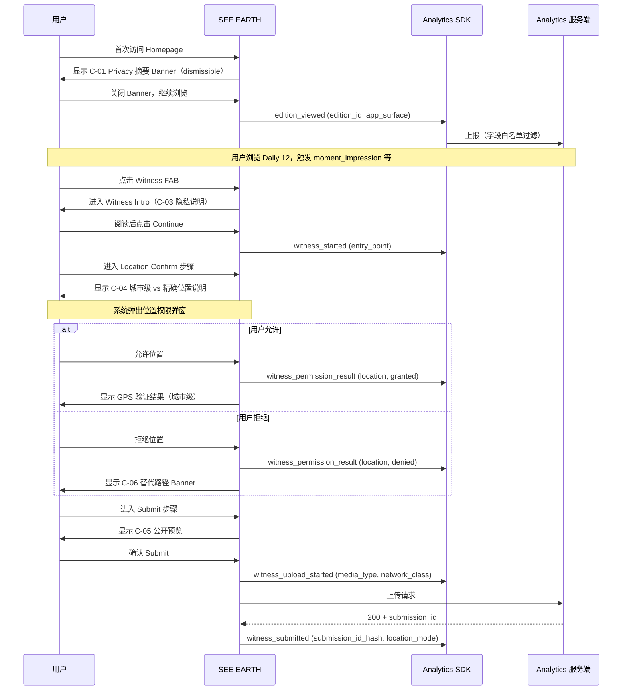

# SEE EARTH V1 · Consent & Privacy Placement（Privacy 文案位置 + 触发条件）

> **目的**：明确"Privacy / Consent 文案在哪里出现 / 何时出现 / 说什么"。文案必须与 `forbidden-fields-v1.md` 联动，让用户能**实际理解**我们不采集什么。
> **核心原则**：**不把权限拒绝设计成惩罚或强制授权**（Brief §D-P0-02）；**不暗示系统能保证绝对匿名**（Brief §D-P0-02）。
> **不在范围内**：完整 Cookie Banner / GDPR 同意流程 — V1 不引入 Cookie 墙，详见 §6。

---

## 1. 文案位置总表

| # | 位置 | 触发条件 | 文案类型 | 主要目的 | 对应埋点 |
|---|---|---|---|---|---|
| C-01 | **首次进入 SEE EARTH** | 用户首次访问 Homepage（无 sessionStorage 标记） | Privacy / Method 摘要（1 屏） | 告知 Analytics 范围 + 隐私承诺 | 与 `edition_viewed` 同时触发展示，但不阻塞 |
| C-02 | **Privacy 页面（永久入口）** | Footer / About / Method 页内的 Privacy Tab | 完整 Privacy 声明 | 用户主动查阅 | 与埋点无关；不发送 `privacy_page_viewed`（避免元埋点） |
| C-03 | **Witness 流程第 1 步（"为什么需要照片 / 时间 / 位置"）** | 用户进入 Witness Intro 步骤 | Witness 隐私说明（强制阅读） | 解释采集范围 + 公开预览 | 与 `witness_started` 同时显示 |
| C-04 | **Witness 流程：位置确认步骤** | 用户进入 Location Confirm 步骤 | 城市级 vs 精确位置说明 | 明确公开 / 私密边界 | 与 `witness_permission_result.location` 接近，但不阻塞权限弹窗 |
| C-05 | **Witness 流程：Submit 步骤** | 用户点击 Submit 前 | 最终提交预览 + 隐私再确认 | 让用户在公开前预览将公开内容 | 与 `witness_upload_started` 前置 |
| C-06 | **Witness 流程：权限弹窗回调后（拒绝时）** | 用户对相机 / 相册 / 位置权限做 `denied` / `restricted` | 解释替代路径 | 不惩罚，提供安全降级 | 与 `witness_permission_result.result=denied` 同步展示 |
| C-07 | **Daily 12 → Moment → City**：可选 Credit / Source 标识 | 任何公共 Moment 卡片底部 | 来源类型 + Witness 标注 | 区分 witness / seed / editorial | 与埋点无关；视觉标识 |
| C-08 | **About / Method 页** | 用户主动访问 | 数据来源 / 隐私方法学 / 时间与位置原则 | 用户主动查阅 | 与埋点无关 |

> **总数 8 个位置**。新增位置必须更新本表 + PM 评审。

---

## 2. 文案内容规范

### 2.1 统一文案原则

- **诚实**：不暗示"绝对匿名"或"完全安全"。Brief §D-P0-02 明确要求"不暗示系统能保证绝对匿名；准确说明实际采集、保存、使用与删除方式"。
- **简短**：每个文案位置不超过 1 屏（手机屏 80% 高度）。
- **可理解**：避免法律黑话（如"数据控制者"），用"我们 / 你"叙述。
- **可行动**：用户能"立即做点什么"（拒绝 / 撤销 / 联系）。
- **不阻塞**：Privacy 摘要不阻塞 `edition_viewed`；Witness 隐私说明阻塞 `witness_started`（必须看完才能 Continue）。

### 2.2 禁采文案原则

- **不显摆**：不写"我们不收集你的位置哦 ❤"这种自我表扬式文案。
- **可验证**：文案与 `forbidden-fields-v1.md` 一致，不夸大也不遗漏。
- **可执行**：用户能在 Privacy 页面看到完整禁采清单。

---

## 3. 各位置详细文案规范

### C-01 · 首次进入 Privacy 摘要

**位置**：Homepage 顶部 Banner（dismissible）或首次访问 Modal（dismissible）。

**触发**：sessionStorage 中无 `privacy_summary_dismissed` 标记 → 用户首次进入即展示一次；用户关闭后**不再自动弹出**，但 Privacy 页面永久可访问。

**文案骨架（中文，待文案定稿）**：

```text
欢迎来到 SEE EARTH。

我们记录你看到哪些 Moment / 城市 / 当日内容，用于改进 Daily 12。
我们不记录你的精确位置、邮箱、手机号、设备指纹或任何可识别你的信息。

Witness 提交的照片仅用于审核，公开显示时只显示城市级位置。
完整说明见 [Privacy] / [Method]。
```

**埋点联动**：与 `edition_viewed` 同时触发；用户关闭 Banner 不计入新事件。

**DO NOT**：
- ❌ 不写 Cookie 同意弹窗（V1 不引入 Cookie）
- ❌ 不写"同意 / 不同意"二元按钮（V1 无登录；用户继续浏览即视为同意基础 Analytics）
- ❌ 不阻塞用户浏览（"Continue"按钮立即可用，"More info"链接到 C-02）

---

### C-02 · Privacy 页面（永久入口）

**位置**：Footer → Privacy / Method → Privacy Tab。

**内容结构**：

| 段落 | 内容 |
|---|---|
| 1. 我们收集什么 | Daily 12 浏览记录、Moment / City / Unknown 进入记录、Witness 提交内容（审核后公开）、Witness 失败的错误类型 |
| 2. 我们不收集什么 | 精确 GPS（除 Witness 后台审核）、原始 EXIF、邮箱、手机号、设备指纹、Cookie 跟踪 |
| 3. 我们如何使用 | 改进 Daily 12 编排、改进 Witness 流程、统计 Daily 12 连续供应能力 |
| 4. 公开显示内容 | Moment：城市 + `captured_at`；Witness：城市级位置 + `captured_at`；永不显示精确 GPS |
| 5. 你能做什么 | 不登录即可使用；不上传任何照片即不参与 Witness；可在浏览器清除 sessionStorage 清除去重键 |
| 6. 联系 | 反馈入口（与 D-P0-03 Alpha / Beta 反馈入口共用） |

**埋点联动**：不发送 `privacy_page_viewed` 等元埋点事件（避免元循环）。

**DO NOT**：
- ❌ 不写法律免责声明（如"不承担责任"）
- ❌ 不写 Cookie Banner / GDPR 同意按钮
- ❌ 不暗示"完全匿名"或"完全安全"

---

### C-03 · Witness Intro 隐私说明

**位置**：Witness 流程第 1 步（"为什么需要照片 / 时间 / 位置"）。

**触发**：用户进入 Witness Intro 步骤即显示；用户必须滚动到底部或停留 ≥ 5 秒后才能点击 `Continue`（强制阅读）。

**文案骨架**：

```text
我们为什么需要这些信息

• 照片 — 让这里被看见
• 拍摄时间 — 让"正在发生"变得真实
• 位置 — 让照片归属于一座城市

公开后会显示：
✓ 城市名
✓ 拍摄时间（精确到分钟）
✓ 你选择的一句话（可选）

不会显示：
✗ 你的精确 GPS
✗ 你的姓名 / 联系方式
✗ 原始照片元数据

继续即表示你理解这些信息将用于审核 + 公开显示。
```

**埋点联动**：与 `witness_started` 同页显示；用户点击 `Continue` 才触发 `witness_started`。

**DO NOT**：
- ❌ 不写"我们保证匿名"
- ❌ 不写"我们不会保留你的照片"
- ❌ 不写"上传即同意"以外的暗示（如暗示上传后不可删除）

---

### C-04 · 位置确认步骤（城市级 vs 精确位置）

**位置**：Witness Location Confirm 步骤（Brief §D-P0-02 "读取并确认 captured_at → 请求位置或手动选择城市 → 最多一段短描述"）。

**触发**：用户进入 Location Confirm 步骤。

**文案骨架**：

```text
位置如何处理

[ 自动检测 ]
如果你允许位置权限，我们会用 GPS 验证你拍摄的城市。
GPS 仅用于验证，不会在公开内容中显示。

[ 手动选择 ]
如果你拒绝权限或选择手动选择，我们仅记录你选的城市。

我们不会：
✗ 公开显示你的 GPS 坐标
✗ 用你的位置向你推送广告或通知
✗ 与第三方共享你的位置
```

**埋点联动**：与位置权限弹窗同时显示；不阻塞权限弹窗。

**DO NOT**：
- ❌ 不把权限拒绝设计为惩罚（如"拒绝将无法提交"）
- ❌ 不暗示位置权限 = 必须授权（手动选择是同等路径）

---

### C-05 · Submit 步骤隐私再确认

**位置**：Witness Submit 步骤（最终提交前）。

**触发**：用户点击 Submit 前展示。

**文案骨架**：

```text
公开预览

你即将提交的内容，审核通过后将以以下形式公开：

✓ 城市：[用户选定的城市]
✓ 拍摄时间：[captured_at，精确到分钟]
✓ 一句话：[用户输入的描述，可选]
✓ 照片：[照片缩略图]

不会公开：
✗ 精确 GPS / 原始 EXIF / 你的姓名或联系方式

如需修改，点击 [返回]；确认提交，点击 [Submit]。
```

**埋点联动**：与 `witness_upload_started` 前置；只有用户确认 Submit 后才发 `witness_upload_started`。

**DO NOT**：
- ❌ 不省略预览（Brief §D-P0-02 AC："用户在最终提交前能看见将被公开的内容"）
- ❌ 不使用 Modal 阻塞用户做选择
- ❌ 不暗示提交后立即公开（必须经过审核）

---

### C-06 · 权限拒绝后替代路径

**位置**：Witness 权限弹窗回调后立即展示（不弹新弹窗，使用页面内 Banner）。

**触发**：`witness_permission_result.result = denied` 或 `restricted`。

**文案骨架**：

```text
[ 相机权限不可用 ]
你拒绝了相机权限。SEE EARTH 仍然支持从相册选择照片。
[ 选择照片 ] / [ 取消并返回 ]

[ 位置权限不可用 ]
你拒绝了位置权限。SEE EARTH 仍然支持手动选择城市。
[ 手动选择城市 ] / [ 取消并返回 ]

[ 权限受限 ]
你的设备权限受限，无法访问 [相机 / 相册 / 位置]。
如需继续，请前往系统设置调整权限后重试。
```

**埋点联动**：与 `witness_permission_result.result=denied/restricted` 同步展示；用户点击替代路径不重计 `witness_started`。

**DO NOT**：
- ❌ 不显示"必须开启权限才能继续"等强制文案（Brief §D-P0-02）
- ❌ 不在 Banner 内隐藏"取消并返回"按钮
- ❌ 不显示具体技术原因（如 iOS ATT 政策）

---

### C-07 · 公共 Moment 来源标识（视觉）

**位置**：Daily 12 卡片底部 / Moment Detail 页脚。

**触发**：任何公共 Moment 卡片可见。

**文案骨架**：

```text
来源：[Witness · XXX] / [Editorial · YYY] / [Seed · ZZZ]
```

> **设计决策**：必须明确区分 `witness` / `seed` / `editorial` 三类来源（Brief §2.3 "Daily 12 必须同时支持 Witness 内容与经明确标记的 Seed / Editorial 内容；两者不可在来源上混淆"）。

**埋点联动**：与 `moment_impression.source_type` / `moment_opened.source_type` 字段同源；视觉标识文本不进入埋点 payload。

**DO NOT**：
- ❌ 不混淆来源（不能把 editorial 标为 witness）
- ❌ 不省略来源标识
- ❌ 不暴露 Witness 任何个人信息（即使 Witness 同意公开 ID，也不显示）

---

### C-08 · About / Method 页（永久入口）

**位置**：Footer → About / Method。

**内容结构**：

| 段落 | 内容 |
|---|---|
| 1. 我们是谁 | SEE EARTH 是什么；为什么做这个产品 |
| 2. 数据来源 | Witness / Editorial / Seed 三类来源如何区分；每类如何审核 |
| 3. 时间原则 | `captured_at` / `uploaded_at` / `published_at` 三者区别；为什么 `captured_at` 是核心 |
| 4. 位置原则 | 公开仅城市级；精确位置仅后台审核；如何处理 GPS 拒绝 |
| 5. 方法学 | Daily 12 如何组版；Editorial 与 Seed 如何与 Witness 共存 |

**埋点联动**：不发送 `about_page_viewed` 等元埋点。

**DO NOT**：
- ❌ 不写长篇法律文本
- ❌ 不暗示"完全匿名"
- ❌ 不省略数据来源说明

---

## 4. 文案时序图（mermaid）



---

## 5. 文案与埋点的事件映射总表

| 文案位置 | 不发送埋点 | 同时触发的埋点 | 与埋点的耦合点 |
|---|---|---|---|
| C-01 Privacy 摘要 Banner | `privacy_summary_dismissed`（session 内仅记 boolean，不入主埋点） | `edition_viewed`（Banner 关闭后即发） | Banner 关闭不阻塞 `edition_viewed` |
| C-02 Privacy 页面 | 不发送 | 无 | 与埋点完全解耦 |
| C-03 Witness Intro | 不发送 | `witness_started`（用户点 Continue） | 文案阅读后才能 Continue |
| C-04 Location Confirm | 不发送 | `witness_permission_result`（系统回调） | 文案与权限弹窗同时显示 |
| C-05 Submit 预览 | 不发送 | `witness_upload_started`（用户点 Submit） | 预览展示后才能点 Submit |
| C-06 权限拒绝 Banner | 不发送 | `witness_permission_result`（denied/restricted） | Banner 显示与埋点同步 |
| C-07 来源标识 | 不发送 | `moment_impression.source_type` / `moment_opened.source_type` | 视觉标识与埋点字段同源 |
| C-08 About / Method | 不发送 | 无 | 与埋点完全解耦 |

---

## 6. 关于 Cookie / GDPR 同意流程的说明

- **V1 不引入 Cookie 墙 / GDPR 同意 Modal**。理由：
  - V1 无登录系统，无跨 session 用户标识。
  - V1 Analytics 不使用 Cookie 进行用户追踪。
  - 唯一持久存储是 sessionStorage（前端去重用），session 结束自动清除。
  - 持久存储 `localStorage` 仅用于生命周期事件（`unknown_revealed` 等）的去重键，不含 PII。
- **何时引入**：若 V1.1 引入登录系统或跨 session 追踪，再走单独的 Cookie / GDPR 同意流程设计。

---

## 7. 与 D-P0-03 Alpha / Beta 状态设计的联动

- Alpha / Beta 阶段的 Privacy 页面需明确标注"测试环境 / 数据可能重置"。
- Alpha / Beta 的 Banner 中加入反馈入口（D-P0-03 负责）。
- Launch Candidate 阶段移除所有测试标识。

---

## 8. 自验收 Acceptance Criteria

- [x] 8 个文案位置全部明确（首次进入 / 隐私设置 / Witness 各阶段 / 来源标识 / About）
- [x] 每个位置都有触发条件 + 文案骨架 + 埋点联动 + DO NOT
- [x] 首次进入 Privacy 摘要不阻塞 `edition_viewed`
- [x] Witness 隐私说明阻塞 `witness_started`（强制阅读）
- [x] Submit 预览满足 Brief §D-P0-02 AC "用户在最终提交前能看见将被公开的内容"
- [x] 权限拒绝 Banner 不设计为惩罚（提供替代路径）
- [x] 来源标识明确区分 witness / seed / editorial
- [x] 文案原则诚实（不暗示绝对匿名 / 完全安全）
- [x] 与 `forbidden-fields-v1.md` 联动（禁采项在 Privacy 页面明示）

---

**End of Consent Placement v1**