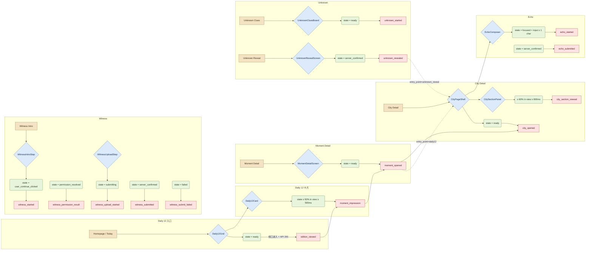
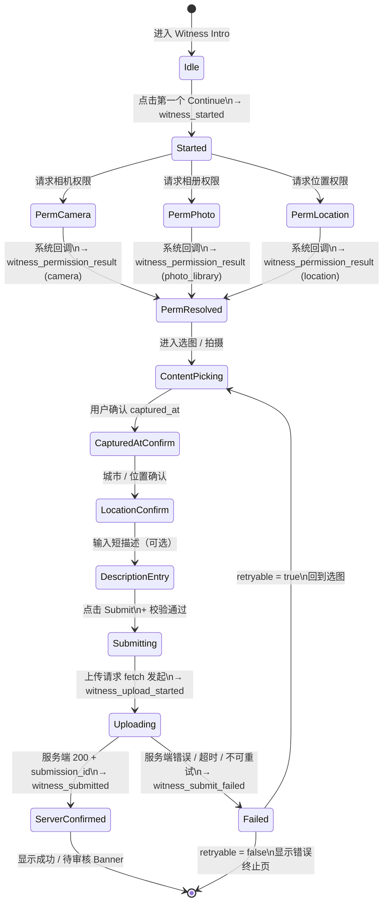
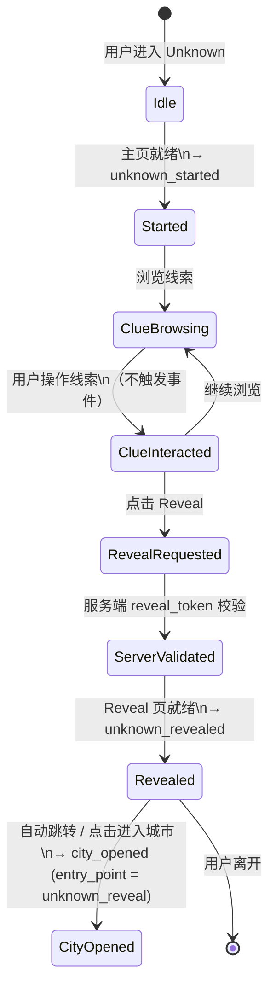
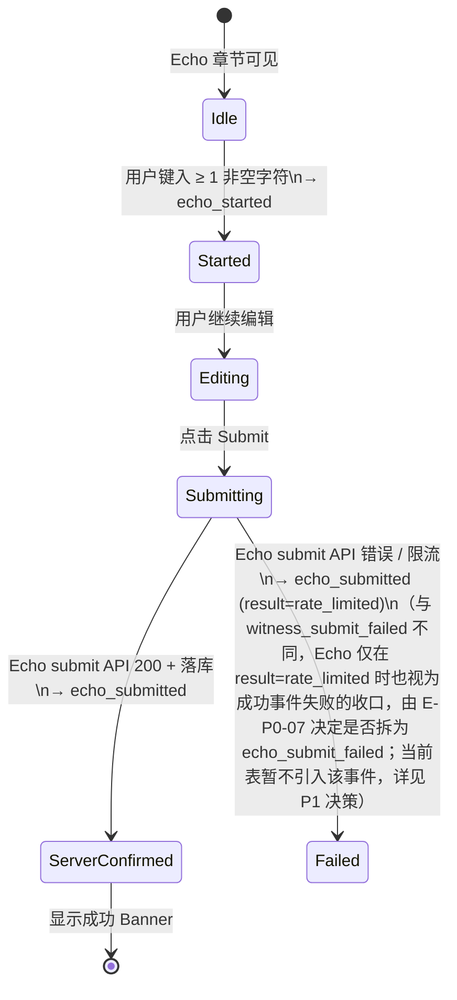
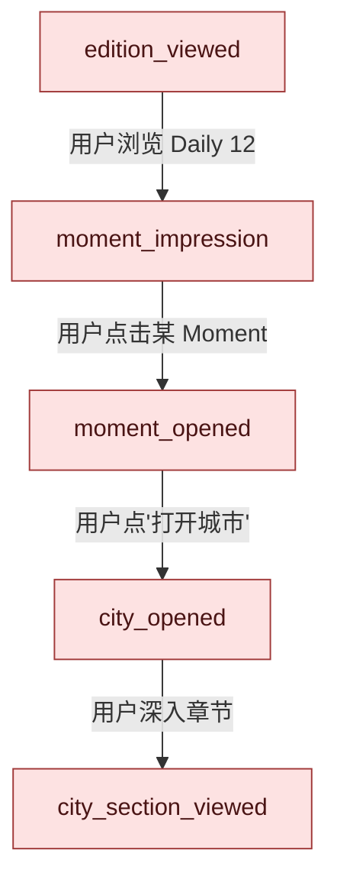
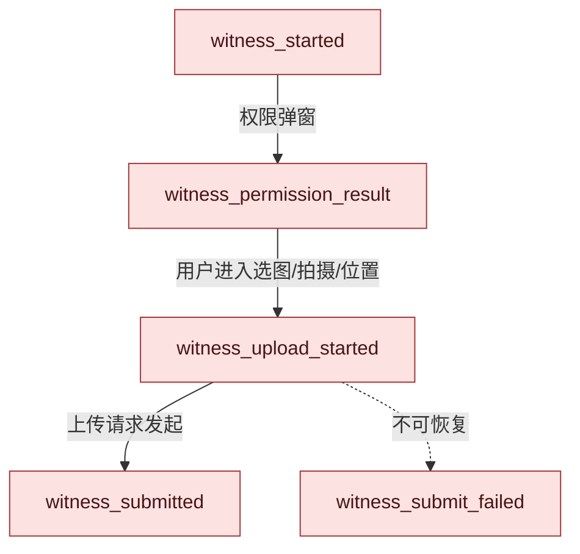

# SEE EARTH V1 · Analytics Trigger Diagram（触发时机图）

> **目的**：把 14 个 P0 事件按"组件 → 状态 → 触发器 → 事件"四级链条全部画清。任何事件都必须由 UI 状态变化或服务端结果触发；**禁止定时器触发"成功"事件**。
> **图例**：`[页面]` = 路由级页面；`{组件}` = React/Vue 组件；`(状态)` = 组件内部 state；`→event` = 发出事件；`S2S` = Server-to-Server，服务端已记录；`C2S` = Client-to-Server，前端发送给埋点后端。

---

## 1. 总览：四级触发链（mermaid）

> **关键约束**：所有 `→event` 边均源自 UI state 变化或服务端 confirmation；任何从 `(state = server_confirmed)` 触发的事件都依赖服务端先返回 success。

---

## 2. 触发矩阵（页面 × 事件 × 触发器）

| 事件 | 页面 | 组件 | 触发 state | 触发器 | 服务端确认 | 防重复键 |
|---|---|---|---|---|---|---|
| `edition_viewed` | Homepage / Today | `<Daily12Grid>` | `state = ready` | IntersectionObserver + edition API 200 | 否 | `edition_id` + `app_surface` |
| `moment_impression` | Homepage / Today | `<Daily12Card>` | `state = ready` | IntersectionObserver（≥ 50% + ≥ 500 ms） | 否 | `moment_id` + `edition_id` |
| `moment_opened` | Moment Detail | `<MomentDetailScreen>` | `state = ready` | 路由切换 + 主图 200 | 否 | `moment_id` + `entry_point` |
| `city_opened` | City Detail | `<CityPageShell>` | `state = ready` | URL 切换 + city API 200 | 否 | `city_id` + `entry_point` |
| `city_section_viewed` | City Detail | `<CitySectionPanel>` | `state = ready` | IntersectionObserver（≥ 60% + ≥ 800 ms） | 否 | `city_id` + `section` |
| `unknown_started` | Unknown Clues | `<UnknownCluesBoard>` | `state = ready` | 主页就绪 + 第 1 个 clue API 200 | 否 | `unknown_id` |
| `unknown_revealed` | Unknown Reveal | `<UnknownRevealScreen>` | `state = server_confirmed` | 服务端 `reveal_token` 校验通过 + Reveal 页就绪 | **是** | `unknown_id` |
| `echo_started` | City Detail / Echo | `<EchoComposer>` | `state = focused + input ≥ 1 char` | 用户首次键入非空字符（input 事件） | 否 | `city_id` |
| `echo_submitted` | City Detail / Echo | `<EchoComposer>` | `state = server_confirmed` | Echo submit API 返回 `200` + `submission_id` 已落库 | **是** | 服务端 confirmation 1:1 |
| `witness_started` | Witness Intro | `<WitnessIntroStep>` | `state = user_continue_clicked` | 用户点击第一个 `Continue` 按钮 | 否 | session_id |
| `witness_permission_result` | Witness 任一步骤 | `<WitnessStep>` 状态机 | `state = permission_resolved` | 系统权限回调（granted / denied / restricted / not_determined） | 否 | `permission_type` + session |
| `witness_upload_started` | Witness Upload | `<WitnessUploadStep>` | `state = submitting` | Submit 点击 + 校验通过 + `fetch` 发起 | 否 | session 内 Submit 次数 |
| `witness_submitted` | Witness Result | `<WitnessResultStep>` | `state = server_confirmed` | 服务端 `submission_id` 已返回 + 状态 `submitted` / `under_review` | **是** | `submission_id` |
| `witness_submit_failed` | Witness Result | `<WitnessResultStep>` | `state = failed` | 上传 / 提交错误 + 前端判定不可重试 / 重试耗尽 | 否（双源：前端 + 错误码） | `submission_id`（若有） |

---

## 3. 状态机：Minimal Witness Flow（精细化）

---

## 4. 状态机：Unknown Coordinate（精细化）

---

## 5. 状态机：Echo（City Detail Echo 章节）

> **设计决策**：Echo 失败（如限流）当前归入 `echo_submitted.result=rate_limited`，**不引入** `echo_submit_failed` 事件。理由：Echo 在 P1 阶段可能整体降级为不可用；此时事件保持稳定 schema 比新增事件更利于 E-P0-07 schema 收敛。如未来 Echo 失败需要细粒度分类，再走"新增事件 + PM 评审"流程。

---

## 6. Daily 12 → Moment → City 转化漏斗（mermaid）

> 此图同时回答 V1 问题 #1 与 #2：`edition_viewed` + `moment_impression` 验证浏览深度；`moment_opened` → `city_opened` → `city_section_viewed` 验证 Moment → City 转化。

---

## 7. Witness 全漏斗（mermaid）

> 漏斗在 `witness_permission_result` 后**强制分叉**：根据 `result` 决定是否进入下一阶段；`denied` / `restricted` 直接结束 session（仍保留 `witness_started` 作为入口计费，但不计入"成功提交率"分母）。

---

## 8. 关键设计决策（精细化触发规则）

### 8.1 "有效可见"判定（`moment_impression` / `city_section_viewed`）

| 维度 | 阈值 | 理由 |
|---|---|---|
| 面积占比 | ≥ 50%（impression）/ ≥ 60%（section） | impression 更宽松，section 因有章节纵深要求更严格 |
| 停留时间 | ≥ 500 ms / ≥ 800 ms | 防止快速滑动产生噪声曝光 |
| 触发器 | IntersectionObserver（`rootMargin: 0px`） | 不使用 scroll listener / ResizeObserver，避免性能与定时器假设 |
| 防滑回 | 滑出 ≥ 1 个卡片宽度后再进入视口才重计 | **明确 DO NOT**：滑回不重复计 |
| 防刷新 | 同 `moment_id` + `edition_id` 在 30 分钟去重窗口内仅计一次 | 防止刷新页面产生大量噪声曝光 |

### 8.2 "开始 Witness"边界（`witness_started`）

| 选项 | 是否采用 | 理由 |
|---|---|---|
| 进入 Witness 页面路由 | 否 | 用户可能误入或自动打开（如 deeplink） |
| 点击 FAB / 入口按钮 | 否 | 不计入正式 started；FAB 点击是"曝光"信号但不是"承诺"信号 |
| **点击第一个 `Continue` 按钮** | **是** | 用户已明确表达"我要开始贡献" |
| 弹出第一个权限弹窗 | 否 | 用户可能拒绝；过早计 started 会污染漏斗 |

### 8.3 "完成 Reveal"成功语义（`unknown_revealed`）

| 选项 | 是否采用 | 理由 |
|---|---|---|
| 用户点击 Reveal 按钮 | 否 | 仅是客户端行为；服务端未确认 |
| 服务端返回 `reveal_token` | 是（前置） | 必须先服务端校验 |
| **Reveal 页（答案 / 城市信息）就绪** | **是** | 用户实际"看到答案"才算 Reveal 完成 |
| 用户跳转进入城市 | 否 | 由 `city_opened.entry_point = unknown_reveal` 单独计 |

### 8.4 Echo / Witness 成功反馈设计

| 场景 | 反馈组件 | 反馈文案原则 | 触发事件 |
|---|---|---|---|
| Echo Submit 成功 | `<EchoResultBanner>`（Success） | "已记录，会在审核后出现" | `echo_submitted.result=accepted` |
| Echo Submit 待审核 | `<EchoResultBanner>`（Info） | "已记录；不会立即显示" | `echo_submitted.result=queued_for_review` |
| Echo 限流 | `<EchoResultBanner>`（Warning） | "稍后再试；不计入本次失败" | `echo_submitted.result=rate_limited` |
| Witness Submit 成功 | `<WitnessResultStep>`（Success） | "已提交；审核后会出现在 Daily 12" | `witness_submitted` |
| Witness 待审核 | `<WitnessResultStep>`（Info） | "已提交；进入审核队列" | `witness_submitted`（同上） |
| Witness 失败可重试 | `<WitnessResultStep>`（Error） + Retry 按钮 | 简短原因 + "重试"按钮 | `witness_submit_failed.retryable=true` |
| Witness 失败不可重试 | `<WitnessResultStep>`（Error） | 解释原因 + "返回首页" | `witness_submit_failed.retryable=false` |

> **统一原则**：成功反馈文案**不暗示"立即可见"**；不假装审核通过；不展示精确时间或位置。

---

## 9. 客户端去重实现建议（给 E-P0-07）

- **存储**：使用 `sessionStorage`（session 级）+ `localStorage`（跨 session，用于 `edition_viewed` / `unknown_revealed` 等生命周期事件）。
- **键格式**：`{event}__{dedupe_key_1}__{dedupe_key_2}`，例如 `moment_impression__m_42__e_2026-08-22`。
- **过期**：TTL 由前端运行时按"事件表 §6"中的窗口管理；TTL 过期键自动清除。
- **可见性事件**：IntersectionObserver + timer 协同，**仅在元素进入视口后启动定时器**，离开视口即清除定时器。
- **服务端 confirmation**：前端必须等待 `fetch` resolve 才发送 success 事件；reject 路径走 failure 事件。

---

## 10. 自验收

- [x] 14 个事件全部有"组件 → 状态 → 触发器"四级链条（无遗漏）。
- [x] 无 setTimeout / setInterval 触发 success 事件（`unknown_revealed` / `echo_submitted` / `witness_submitted` 全部以服务端 confirmation 为前置）。
- [x] 可见性事件使用 IntersectionObserver + 停留阈值，不用 scroll listener / 定时器。
- [x] 滑回 / 重复刷新有明确去重窗口（见 §6 + `event-map-v1.md` §6）。
- [x] 成功 / 失败反馈组件、文案原则、触发事件三者一一对应。
- [x] 漏斗图覆盖 Daily 12、Moment → City、Unknown、Witness 四条主路径。

---

**End of Trigger Diagram v1**