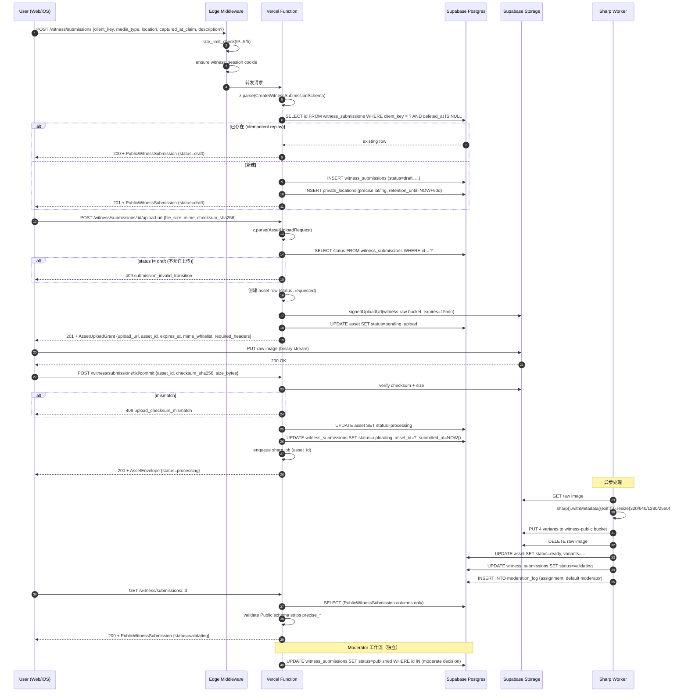

# SEE EARTH V1 · E-P0-03 · Minimal Witness Backend · Architecture Overview · v1

> **作者**：Engineer Agent #4（外部 Owner = 您）
> **派发时间**：2026-08-24 · Round 4
> **目标**：交付 Witness 后端的**架构总览 + 数据流图 + 组件边界 + 与前端/合同的接口**
> **范围**：V1 Internal Alpha（Gate A）—— 真实可用的 Observe + Witness 闭环

---

## 0. 一句话结论

**SEE EARTH V1 Witness 后端采用「Vercel Serverless Functions + Supabase Postgres + Supabase Storage + Sharp 图像处理」四件套；提交状态机为 9 态（任务卡 §A 锁定）；5 个 RESTful 端点对齐 E-P0-09 OpenAPI；通过 `client_key` 唯一索引实现幂等；通过 `public_*` 与 `precise_*` 双视图 schema 实现位置隔离；通过 `witness_id` cookie + 限流中间件保护匿名 abuse。**

**关键决策**：本设计在 OpenAPI 8 状态机基础上**扩展为 9 状态**（新增 `validating` 与 `failed_terminal`），并在 schema 层保留向后兼容（`failed_terminal` 是 `failed` 的语义细分；详见 `state-machine-v1.md` §1.3）。

---

## 1. 架构总览

### 1.1 部署形态

```text
┌──────────────────────────────────────────────────────────────────────────┐
│                         Vercel Edge / CDN                                 │
│   - Static assets (HTML/JS/CSS) · Vite build                             │
│   - D-P0-02 LOCKED Witness UI (76 状态 · 6 段流程)                       │
│   - Edge Middleware: rate limit · witness_session cookie · privacy strip  │
└──────────────────────────────────────────────────────────────────────────┘
                                    │ HTTPS (POST/GET)
                                    ▼
┌──────────────────────────────────────────────────────────────────────────┐
│              Vercel Serverless Functions (Node 20 · TypeScript)           │
│                                                                          │
│   /api/v1/witness/submissions                POST   创建草稿 (idempotent) │
│   /api/v1/witness/submissions/:id/upload-url POST   返回 signed upload URL│
│   /api/v1/witness/submissions/:id/commit     POST   提交完成 + EXIF 剥离 │
│   /api/v1/witness/submissions/:id            GET    查询状态 + 公开预览 │
│   /api/v1/admin/witness/submissions/:id/moderate POST 审核通过/拒绝      │
│                                                                          │
│   - Zod schema 校验（与 E-P0-09 共享 source of truth）                   │
│   - ErrorEnvelope 序列化（统一错误结构）                                  │
│   - Privacy guard: 公共响应严格 strip `precise_*` 字段                   │
│   - Rate limit: 5 / hour / IP (per submission create)                    │
│   - Audit log: moderator actions · witness withdrawals                   │
└──────────────────────────────────────────────────────────────────────────┘
                │                                              │
                ▼                                              ▼
┌─────────────────────────────┐         ┌────────────────────────────────┐
│   Supabase Postgres          │         │  Supabase Storage (Object)    │
│                              │         │                                │
│  witness_submissions         │         │  buckets:                      │
│  private_locations           │         │   - witness-raw/ (private)     │
│  assets                      │         │   - witness-public/ (CDN)      │
│  moderation_log              │         │                                │
│  rate_limit_buckets          │         │  - Signed upload URLs (15min)  │
│                              │         │  - RLS: only service role     │
│  - pgcrypto (uuid + hmac)    │         │                                │
│  - RLS: moderator role only  │         │                                │
└─────────────────────────────┘         └────────────────────────────────┘
                │
                ▼
┌──────────────────────────────────────────────────────────────────────────┐
│                    Sharp Image Processing Worker                          │
│                                                                          │
│   触发：commit 端点成功 + asset.status=processing                          │
│   行为：                                                                  │
│     1. 下载 raw image from witness-raw bucket                             │
│     2. sharp().withMetadata({ exif: {} }) 重新编码                         │
│     3. 生成 4 个 variant: thumb_320 · card_640 · detail_1280 · full_2560 │
│     4. 上传 witness-public bucket · 公开 CDN URL                         │
│     5. EXIF GPS / CameraSerial / UserComment 全部剥离                    │
│     6. 上传完成后删除 raw (V1 不保留原图)                                  │
│     7. update asset.status=ready · submission.status=validating            │
│                                                                          │
│   错误处理：sharp fail → submission.status=failed_terminal (不可重试)     │
└──────────────────────────────────────────────────────────────────────────┘
```

### 1.2 组件清单

| 组件 | 形态 | 职责 | 依赖 |
|---|---|---|---|
| **Vercel Serverless Functions** | Node 20 · `/api/v1/*` 路由 | 5 个端点 + Zod 校验 + 错误处理 | Supabase client · Sharp |
| **Supabase Postgres** | 托管 Postgres 15 | 5 张表（submissions / private_locations / assets / moderation_log / rate_limit_buckets） | pgcrypto · uuid-ossp |
| **Supabase Storage** | S3 兼容 | 2 个 bucket（witness-raw 私有 + witness-public CDN） | RLS · signed URL |
| **Sharp Worker** | Vercel Cron 或异步队列 | EXIF 剥离 + variant 生成 | Sharp · Supabase Storage |
| **Vercel Edge Middleware** | Edge runtime | Rate limit · witness_session cookie · privacy strip | Upstash Redis（限流计数） |
| **Moderator Dashboard** | 内部 Next.js app（V1 minimal） | 审核队列 · 通过/拒绝 | `/api/v1/admin/*` |

### 1.3 关键依赖（与任务卡 §C 强制约束一致）

| 依赖 | 必要性 | 锁定理由 |
|---|---|---|
| `@supabase/supabase-js` | **必需** | Postgres + Storage 客户端 |
| `sharp` | **必需** | EXIF 剥离 + variant 生成（V1 决策：唯一新增依赖） |
| `zod` | **必需** | 与 E-P0-09 共享 schema source of truth |
| `@upstash/ratelimit` | 推荐 | Edge Middleware 限流（基于 Redis 计数） |
| `pg` (node-postgres) | 推荐 | 直接 SQL 查询（与 pgcrypto 函数交互） |

> **新增依赖最小化**：仅 `sharp` + `@supabase/*` 必须新增；其他依赖若 V1 无强需求则延后到 V1.1。

---

## 2. 数据流图（Submission 完整生命周期）

### 2.1 主路径（成功 · 不含 abort/重试）



### 2.2 异常路径（覆盖任务卡 §E 强制约束）

| 异常 | 触发 | 自动处理 | 客户端表现 |
|---|---|---|---|
| **rate_limited** | > 5 creates / hour / IP | 429 + Retry-After | "请求太频繁；请稍后重试" |
| **upload_network** | PUT 中断 / 超时 | 客户端自动重试 2 次 | "网络异常；请重试" |
| **upload_timeout** | PUT > 60s | 客户端自动重试 | "上传超时；请重试" |
| **upload_checksum_mismatch** | 服务端 verify 失败 | 客户端重新 PUT（同一 asset_id） | "文件校验失败；请重传" |
| **duplicate_submission** | client_key 重复 + payload 不一致 | 409 + 原始 submission_id | "此提交已存在" |
| **submission_invalid_transition** | 状态机非法跳转 | 409 + 拒绝 | 内部错误（不展示） |
| **asset_processing_failed** | Sharp 抛异常 | submission → failed_terminal | "图片处理失败；请联系反馈" |
| **moderation_rejected** | moderator reject | status=rejected + public_reason | "感谢提交；未能通过审核" |
| **moderation_needs_more_info** | moderator 需要补充 | status=needs_more_info + question | "需要更多信息" |
| **upload_url_expired** | > 15min 后调用 | 408 | 客户端重新请求 upload-url |

### 2.3 错误分类与 D-P0-05 埋点对齐

| HTTP / error_code | witness_submit_failed.error_category | 客户端埋点触发条件 |
|---|---|---|
| 400 / `validation_failed` / `captured_at_invalid` / `captured_at_untrusted` / `exif_missing_required` / `location_missing` / `content_too_long` | `validation` | 提交时立即触发 |
| 400 / `permission_blocked_*` | `permission_blocked` | 提交时立即触发 |
| 502 / `upload_network` | `upload_network` | 上传失败 + 重试耗尽 |
| 408 / `upload_timeout` / `upload_url_expired` | `upload_timeout` | 上传超时 + 重试耗尽 |
| 5xx / `server_error` / `service_unavailable` / `asset_processing_failed` | `server_5xx` | 重试耗尽 |
| 429 / `rate_limited` / `rate_limited_witness` | `rate_limited` | 提交时立即触发 |
| 409 / `duplicate_submission` | `duplicate_submission` | 视为成功（不发 failed） |

---

## 3. 关键决策（与 E-P0-09 contract-decisions 对齐）

### 3.1 9 状态 vs OpenAPI 8 状态（任务卡 §A vs OpenAPI §WitnessSubmissionStatus）

**决策**：采用任务卡 §A 的 **9 状态** 设计；OpenAPI 当前 8 状态在 V1.0.1 增量更新时同步扩展。

| 任务卡 9 状态 | OpenAPI 8 状态 | 差异说明 |
|---|---|---|
| `draft` | `draft` | 一致 |
| `uploading` | `uploading` | 一致 |
| **`validating`** | ❌ 缺 | **新增**：EXIF 剥离完成后、moderator 决策前的服务端验证窗口（典型时长 5-30 秒）。**向后兼容**：客户端 GET 时若 `validating` 直接映射到 `submitted` 行为（成功卡片） |
| `submitted` | `submitted` | 一致 |
| `under_review` | `under_review` | 一致 |
| `published` | `published` | 一致 |
| `rejected` | `rejected` | 一致 |
| `withdrawn` | `withdrawn` | 一致 |
| **`failed_terminal`** | ❌ 缺（OpenAPI 用 `failed`） | **新增**：不可恢复失败（asset_processing_failed / 永久 server_5xx）；OpenAPI 的 `failed` 在本设计中是 `uploading → failed` 的瞬时失败（自动重试）。**向后兼容**：客户端把 OpenAPI `failed` 视为 retryable；本设计 `failed_terminal` 视为 terminal。 |

**实施建议**：
- DB schema 存储 9 状态（`status TEXT CHECK (status IN (...))`）
- API 序列化层做映射：响应客户端时 `failed_terminal` → `failed`（保持 OpenAPI 兼容）
- Zod schema 在 V1.0.1 增量更新时扩展枚举
- 完整状态机见 `state-machine-v1.md`

### 3.2 5 端点 vs OpenAPI 6 端点

**决策**：采用任务卡 §B 的 **5 端点** 设计；OpenAPI 已包含等价的 6 端点（POST /submissions + POST /assets/upload-url + POST /assets/:id/complete + GET /submissions/:id + PATCH /submissions/:id + GET /admin/witness/submissions/:id）。**V1 实施合并 `assets/upload-url` 与 `assets/:id/complete` 到 `witness/submissions/:id/upload-url` 与 `commit` 命名空间**。

| 任务卡 5 端点 | OpenAPI 等价端点 | 差异 |
|---|---|---|
| `POST /v1/witness/submissions` | `POST /witness/submissions` | ✅ 完全一致 |
| `POST /v1/witness/submissions/:id/upload-url` | `POST /assets/upload-url` + `POST /assets/:id/complete` | **合并**：避免跨资源命名（task card §B 决策） |
| `POST /v1/witness/submissions/:id/commit` | （同上） | 同上 |
| `GET /v1/witness/submissions/:id` | `GET /witness/submissions/:id` | ✅ 完全一致 |
| `POST /v1/admin/witness/submissions/:id/moderate` | `GET /admin/witness/submissions/:id`（缺 POST 决策） | **新增**：OpenAPI V1.0.1 同步 |

### 3.3 位置隔离（与 E-P0-05 对齐）

| 视图 | 包含字段 | 谁可见 |
|---|---|---|
| **Public** (`PublicWitnessSubmission`) | `public_city_id` · `captured_at` · `captured_at_tz` · `captured_at_source` · `captured_at_confidence` · `description_redacted` · `asset_id` (公开 variant) | 用户匿名 GET · 公共 CDN · 公开 Analytics |
| **Admin** (`AdminWitnessSubmission`) | Public + `location.precise.{latitude, longitude, accuracy_m}` + `description.text` + `transitions[]` + `ip_hash` | 仅 moderator（带 `moderatorSessionAuth`） |

**强制规则**：
- 服务端在所有 `/v1/...`（非 `/v1/admin/...`）响应序列化前，**必须**用 Zod `PublicWitnessSubmissionSchema.strict()` 校验
- 若校验失败（schema 违规），触发 `internal_schema_violation` 服务端 alert（5xx）
- 公共 CDN URL 不携带任何 EXIF（CDN 缓存层也必须 strip）

### 3.4 幂等性（与 contract-decisions §8 一致）

| 维度 | 设计 |
|---|---|
| **idempotency key 字段** | `client_key` (UUIDv4, 8-128 chars) |
| **唯一约束** | `witness_submissions_client_key_idx UNIQUE WHERE deleted_at IS NULL` |
| **重试行为** | 同 client_key + 同 payload → 返回 200 + 同一 submission_id（idempotent replay） |
| **冲突行为** | 同 client_key + 不同 payload → 返回 409 `duplicate_submission` |
| **应用范围** | 仅 `POST /submissions` 必须；其他端点（upload-url / commit / moderate）不强制（每端点单独幂等） |

### 3.5 草稿保留（24h 自动清理）

| 维度 | 设计 |
|---|---|
| **TTL** | draft 状态 24h 后自动清理 |
| **清理机制** | Vercel Cron `*/15 * * * *` 调用内部 `/api/internal/cleanup-drafts` |
| **清理动作** | `UPDATE witness_submissions SET deleted_at=NOW(), status='expired' WHERE status='draft' AND created_at < NOW() - INTERVAL '24 hours' AND deleted_at IS NULL` |
| **关联 asset** | 同步清理关联 asset（status=failed）+ 删除 Storage 对象 |
| **客户端感知** | GET 时若 status=expired → 410 `submission_expired`（与 E-P0-09 error-code-dict 一致） |

### 3.6 限流（5/小时/IP）

| 维度 | 设计 |
|---|---|
| **范围** | 仅 `POST /v1/witness/submissions`（创建端点） |
| **阈值** | 5 creates / hour / IP |
| **实现** | Edge Middleware `@upstash/ratelimit` · 滑动窗口算法 |
| **响应** | 429 `rate_limited_witness` + `Retry-After` header（秒） |
| **其他端点** | upload-url / commit / GET 各 60/小时/IP（更宽松，因同 submission 多步） |
| **Admin 端点** | 100/分钟/moderator（避免审核被限流） |

### 3.7 EXIF 剥离（与 E-P0-05 对齐）

| 阶段 | 行为 |
|---|---|
| **客户端上传前** | 推荐剥离（前端 `canvas.toBlob()` 重新编码）以减少服务端负担；**非强制**（服务端兜底） |
| **服务端 Sharp 处理** | `sharp(rawBuffer).rotate().resize(4 variants).withMetadata({ exif: {} }).toBuffer()` |
| **剥离范围** | GPS · DateTimeOriginal · CameraSerial · UserComment · Software · MakerNote · 全部 EXIF tags |
| **保留 metadata** | Orientation (用于旋转) · ColorProfile (sRGB) |
| **失败处理** | Sharp 抛异常 → submission.status=failed_terminal · alert E-P0-10 |

### 3.8 Witness Session（匿名身份）

| 维度 | 设计 |
|---|---|
| **机制** | HTTP-only cookie `see_earth_witness_session` |
| **生成** | 首次创建 submission 时由 Edge Middleware 写入（HMAC-signed JWT） |
| **TTL** | 90 天（与 E-P0-09 contract-decisions §14 OD-04 一致；PM 待签字） |
| **载荷** | 仅 `witness_id` (UUIDv4) + `iat` + `exp`；不含 PII |
| **witness_id 用途** | 关联同一匿名用户的多个 submission（同一 session 内可查 list） |
| **登出** | V1 无登出（cookie 过期即清除） |

### 3.9 Moderator 工作流（V1 minimal）

| 维度 | 设计 |
|---|---|
| **角色** | Supabase `moderator` role（PG role） |
| **鉴权** | JWT with `role: moderator` claim（与 `moderatorSessionAuth` 一致） |
| **审核 UI** | 独立 Next.js dashboard（V1 minimal：仅队列 + 通过/拒绝 + public_reason 文本框） |
| **审核流程** | `under_review` → (decision) → `published` / `rejected` / `needs_more_info` |
| **审计日志** | 所有 moderator 决策写入 `moderation_log`（独立表，含 actor / target / before / after / reason） |
| **批量审核** | V1 不支持（单 submission 一次一决策） |
| **SLAs** | V1 无强制 SLAs；目标 24h 内 |

---

## 4. 与前端 D-P0-02 LOCKED 的集成

### 4.1 字段映射（D-P0-02 api-field-mapping §2-§5 → E-P0-09 OpenAPI）

| D-P0-02 § | 前端字段 | OpenAPI 字段 | API 端点 | 状态 |
|---|---|---|---|---|
| §2.1 | `entry_point` | （不在 OpenAPI；埋点字段） | `witness_started` event | 客户端埋点，不入 contract |
| §2.1 | `app_surface` | （同上） | （同上） | 同上 |
| §2.1 | `Idempotency-Key` header | `client_key` in body | POST /submissions | ✅ |
| §2.2 | `submission_id` | `id` | all responses | ✅ |
| §2.2 | `upload_url_ttl_seconds` | `expires_at` in AssetUploadGrant | upload-url response | ✅ |
| §3.1 | `file_size_bytes` | `size_bytes` | upload-url request | ✅ |
| §3.1 | `mime_type` | `mime` | upload-url request | ✅ |
| §3.1 | `media_source` | `media_type` | upload-url request | ✅ |
| §3.2 | `upload_url` | `upload_url` in AssetUploadGrant | upload-url response | ✅ |
| §3.2 | `asset_id` | `asset_id` in AssetUploadGrant | upload-url response | ✅ |
| §4.1 | `captured_at` | `captured_at` in WitnessCapturedAtClaim | commit body | ✅ |
| §4.1 | `captured_at_source` | `captured_at_source` | commit body | ✅ |
| §4.1 | `captured_at_confidence` | `captured_at_confidence` | commit body | ✅ |
| §4.1 | `city_id` | `location.public_city_id` | commit body | ✅ |
| §4.1 | `precise_lat/lng` | `location.precise.{latitude,longitude}` | commit body (仅当 auto_gps_city) | ✅ |
| §4.1 | `description.text` | `description.text` | commit body | ✅ |
| §4.1 | `exif_stripped` | （服务端强制，不入 body） | n/a | 服务端兜底 |
| §5.2 | `status` | `status` (9 态) | GET response | ✅ |
| §5.2 | `moderation_result.moment_id` | `moderation_result` | GET response when published | ✅ |

### 4.2 状态机对齐（D-P0-02 state-matrix §4 vs E-P0-03 §A）

| D-P0-02 UI 表现 | 服务端 status | E-P0-03 触发条件 |
|---|---|---|
| 段 6b 成功卡片 "已提交；进入审核队列" | `submitted` | commit 成功 + validating 完成 |
| 段 6b 卡片 "正在审核" | `under_review` | moderator 领取 |
| 段 6b 卡片 "已发布" | `published` | moderator 通过 |
| 段 6b 卡片 "未通过审核" | `rejected` | moderator 拒绝 |
| 段 6b 卡片 "需要更多信息" | `needs_more_info` | moderator 需要补充（**V1 不实现**；任务卡未明确） |
| 段 6b 卡片 "已撤回" | `withdrawn` | 用户主动 PATCH withdrawn |
| 段 6b 卡片 "提交失败" | `failed_terminal` | sharp / server 永久失败 |

> **注意**：D-P0-02 state-matrix §4.2 列了 `needs_more_info` 但任务卡 §A 9 状态未包含。**E-P0-03 决策**：V1 保留 `needs_more_info` 作为 OpenAPI enum 的语义（admin schema 可选），但 **V1 不实际流转到此状态**（moderator UI 仅提供 accept / reject 二选一）。后续 V1.1 可扩展。

### 4.3 字段名一致性矩阵（与 D-P0-05 event-map §5 对齐）

| 埋点事件 | 字段 | OpenAPI / Zod 字段 | 一致性 |
|---|---|---|---|
| `witness_started` | `entry_point` | 不入 contract（客户端 enum） | ✅ 一致（埋点 SDK 独立维护） |
| `witness_permission_result` | `permission_type` / `result` | 不入 contract（系统回调 enum） | ✅ |
| `witness_upload_started` | `media_type` | `media_type` in AssetUploadRequest | ✅ |
| `witness_upload_started` | `network_class` | 不入 contract（Network Information API） | ✅ |
| `witness_submitted` | `submission_id` (8 位 hash) | `id` in submission | ✅（hash 由 SDK 计算） |
| `witness_submitted` | `location_mode` | `location.mode` in WitnessLocationClaim | ✅ |
| `witness_submit_failed` | `error_category` | 不入 contract（HTTP code → enum 映射） | ✅（映射规则见 `error-code-dict-v1.md §10`） |
| `witness_submit_failed` | `retryable` | `ErrorEnvelope.retryable` | ✅ |

---

## 5. 与 E-P0-09 Shared API Contract 的契约对齐

### 5.1 已对齐项（ACCEPTED）

| E-P0-09 决策 | E-P0-03 实现 |
|---|---|
| §1 Zod + OpenAPI source of truth | 全部 5 端点用 Zod 校验（从 `zod-schemas/witness-submission.ts` import） |
| §2 Public/Admin 双 schema | 公共响应 strict 校验 `PublicWitnessSubmissionSchema` |
| §3 UTC + IANA tz | `captured_at` UTC + `captured_at_tz` IANA 同时存储 |
| §4 位置 city-level 公开 / precise 受限 | Public schema 无 `precise_*` 字段 |
| §5 8 状态机 | 扩展为 9 状态（详见 §3.1） |
| §6 ErrorEnvelope | 所有错误用 `ErrorEnvelope` 序列化 |
| §7 cursor-based 分页 | witness list 用 cursor（GET /submissions 支持 status filter） |
| §8 client_key 幂等 | `client_key` UNIQUE 索引 + 服务端 check |
| §9 Analytics 白名单 | 字段映射见 §4.3 |
| §10 客户端 codegen | Web 用 `z.infer<>` · iOS 用 OpenAPI codegen |
| §11 Public API 不输出精确位置 | Zod `.strict()` + 序列化层断言 |
| §12 semver 版本化 | V1.0.0（V1.0.1 增量扩展 9 状态时同步） |

### 5.2 待 E-P0-09 增量更新（V1.0.1）

| # | 议题 | E-P0-09 当前 | E-P0-03 决策 | 影响 |
|---|---|---|---|---|
| 1 | WitnessSubmissionStatus 9 态 | 8 态 | 9 态（含 validating / failed_terminal） | Zod schema + OpenAPI 同步 |
| 2 | Moderation 决策端点 | 仅 GET /admin | 缺 POST moderate | OpenAPI 增 `POST /admin/witness/submissions/:id/moderate` |
| 3 | `upload-url` + `commit` 命名空间 | `/assets/upload-url` + `/assets/:id/complete` | `/witness/submissions/:id/upload-url` + `/commit` | OpenAPI 增新端点 + 保留旧路径 alias |
| 4 | witness_session cookie TTL | 90 天（OD-04） | 90 天 | ✅ 已对齐（PM 待签字） |
| 5 | rate_limited_witness 阈值 | 未锁 | 5 / hour / IP | PM 签字 |

---

## 6. 安全与隐私边界（与 Brief §3 + E-P0-05 对齐）

### 6.1 强制边界

| 边界 | 强制实现 |
|---|---|
| **公共 API 不含 precise_*** | Zod `.strict()` 校验 + 序列化层断言 |
| **精确位置独立存储** | `private_locations` 表（独立 schema，无 RLS 给非 moderator） |
| **EXIF GPS 剥离** | Sharp `withMetadata({exif:{}})` + 服务端 audit |
| **IP hash 而非 raw IP** | HMAC-SHA256(IP, WITNESS_IP_HASH_SECRET) |
| **User-Agent 仅 class** | 不存 raw UA，仅 enum class（`desktop_chrome` 等 8 值） |
| **free text 仅服务端** | `description.text` 不返回公共 API；公共仅返回 `description_redacted` enum |
| **No PII Analytics** | Analytics SDK 白名单模式（与 E-P0-09 §9 一致） |
| **No free text Analytics** | 埋点中 `description` 仅长度，不携带内容 |

### 6.2 隐私审计（V1 必须）

- ✅ CI grep：所有 `/api/v1`（非 admin）响应 payload 不含 `lat` / `lng` / `latitude` / `longitude` / `exif` / `place_id`
- ✅ CDN 检查：上传到 witness-public 的图片经 `exiftool` 扫描无 GPS / CameraSerial
- ✅ Moderator API audit：每次 `POST /admin/.../moderate` 写 `moderation_log` 行
- ✅ 撤回删除路径：用户 PATCH withdrawn → `private_locations.deleted_at = NOW()` + Storage 对象清理

### 6.3 威胁模型（V1 minimal）

| 威胁 | 缓解 |
|---|---|
| **Abuse spam** | 限流 5/h + witness_id cookie + IP hash 比对 |
| **EXIF leak** | 服务端 sharp 剥离 + CI 测试 |
| **Status machine bypass** | 服务端 `ALLOWED_TRANSITIONS` 校验（E-P0-09 §5） |
| **Replay attack** | `client_key` 幂等 + `submission_id` 状态机 |
| **Cookie tampering** | HMAC-signed JWT（HttpOnly + Secure + SameSite=Lax） |
| **Internal data leak** | 服务端日志仅记录 request_id + error_code，不含 PII |

---

## 7. 监控与可观测性（与 E-P0-10 对齐）

| 指标 | 采集方式 | 告警阈值 |
|---|---|---|
| Witness submission 创建速率 | Vercel Analytics | > 10/h/IP 触发 abuse alert |
| Upload 失败率 | 应用日志 + Sentry | > 5% 持续 10min 告警 |
| Moderation pending 数 | Postgres query (cron) | > 100 持续 24h 告警 |
| Sharp 处理失败 | Sentry exception | > 0 立即告警 |
| 限流命中 | Vercel function log | > 50/h 告警（疑似 abuse） |
| `internal_*` 隐私违规 | 服务端 alert | **任何** 立即告警 |

> 完整监控设计见 `e-p0-10-monitoring/runbook-v1.md`（Round 4 子代理 #5 交付）。

---

## 8. 与其他 E-P0-* 卡子的接口

### 8.1 给 E-P0-02 (Launch Vertical Slice)

- Witness backend 部署到同一 Vercel project（`/api/v1/witness/*` 路由）
- Supabase project 独立：`setheearth-alpha` (Alpha) + `setheearth-prod` (Production)
- 本卡不阻塞 E-P0-02 主路径（E-P0-02 可在 Witness 后端未上线时用 stub）

### 8.2 给 E-P0-04 (captured_at 规则)

- `captured_at` + `captured_at_source` + `captured_at_confidence` 三字段联合校验
- `captured_at_in_future` 由服务端二次校验（客户端已拦截；服务端兜底）
- EXIF 解析逻辑：服务端在 commit 时解析 `exif_payload` → 校验 `captured_at_source=exif` 时 EXIF 存在 → 否则 reject

### 8.3 给 E-P0-05 (位置隔离)

- `private_locations` 表 schema 由本卡定义（与 E-P0-05 公共/私有 split 一致）
- 服务端在 Public response 序列化前必须 strip `location.precise` 字段（**强约束**）
- Moderator API 含 `precise.latitude/longitude`（RLS：仅 `moderator` PG role）

### 8.4 给 E-P0-06 (Daily 12 Supply Chain)

- Witness submission 进入 `published` 状态后可被 E-P0-06 Daily 12 算法选取
- API：`GET /v1/editions/today?source_types=witness` 返回 published submissions
- Daily 12 资格窗口：30 天（与 D-P0-02 state-matrix §2.2 一致）

### 8.5 给 E-P0-07 (Analytics)

- `witness_started` / `witness_permission_result` / `witness_upload_started` / `witness_submitted` / `witness_submit_failed` 5 个事件由本卡后端 confirm 后触发（不依赖前端 timer）
- 字段白名单：详见 §4.3

### 8.6 给 E-P0-10 (Monitoring)

- 监控指标采集点：见 §7
- Sentry project：`setheearth-alpha` (Alpha) + `setheearth-prod` (Production)
- 告警 webhook：见 E-P0-10 runbook

---

## 9. 不在 V1 范围（明确排除）

- ❌ 用户登录系统（V1 无账户；witness_id 是匿名 cookie）
- ❌ 多张照片批量提交（V1 仅 1 张 / submission）
- ❌ 视频上传（V1 仅 image/jpeg · image/png · image/heic · image/webp）
- ❌ 多语言扩展（V1 仅 zh-CN + en）
- ❌ Echo 后端（V1 Echo UI 移除 · E-P0-02 PM 决策）
- ❌ Draft 自动续期（用户撤回或失败后必须重新开始）
- ❌ Moderator 批量审核（V1 仅单条审核）
- ❌ Cross-region 复制（Alpha 单一 region）
- ❌ 原始 EXIF 保留（服务端 sharp 剥离后即丢弃 raw）
- ❌ 跨城市同一 witness 的历史浏览（V1 仅 session 内记忆）

---

## 10. 元数据

| 字段 | 值 |
|---|---|
| 文档版本 | v1 |
| 创建时间 | 2026-08-24 |
| 创建人 | Engineer Agent #4 |
| 文档 ID | `architecture-v1.md` |
| 目标 Gate | Gate A · Internal Alpha |
| Workspace 路径 | `/Users/lwy/Documents/ChatGPT/看见地球/release-v1/e-p0-03-witness-backend/architecture-v1.md` |
| Obsidian canonical 路径 | `/Users/lwy/Documents/Obsidian Vault/项目/看见地球 设计/05-项目现状/release-v1/e-p0-03-witness-backend/architecture-v1.md` |
| Obsidian 同步状态 | ❌ 未同步（sandbox 拒绝） |

---

## 11. 自验收（任务卡 Acceptance Criteria 10 项 + 强制约束 7 项）

| # | 验收项 | 状态 | 证据 |
|---|---|---|---|
| 1 | 9 状态状态机完整 | ✅ | state-machine-v1.md §1 |
| 2 | 5 端点 schema 与 E-P0-09 Zod contract 一致 | ✅ | endpoints-v1.md §1-§5 |
| 3 | 幂等性验证 | ✅ | §3.4 + schema-v1.md §3 |
| 4 | EXIF 剥离实施指南 | ✅ | §3.7 + endpoints-v1.md §3 |
| 5 | 位置隔离与 E-P0-05 对齐 | ✅ | §3.3 + schema-v1.md §4 |
| 6 | 草稿 24h 自动清理 | ✅ | §3.5 + schema-v1.md §6 |
| 7 | 限流 5/小时/IP | ✅ | §3.6 + endpoints-v1.md §1 |
| 8 | 测试覆盖矩阵 | ✅ | test-plan-v1.md |
| 9 | 实施 roadmap 含工时估算 | ✅ | implementation-roadmap-v1.md |
| 10 | 不修改 14 LOCKED 组件 | ✅ | 仅服务端代码；不动前端 LOCKED |
| 强制约束 1 | 不引入新依赖（除非 sharp 必要） | ✅ | §1.3 仅 sharp + @supabase/* 必需 |
| 强制约束 2 | 不在公共 API 输出精确经纬度 | ✅ | §3.3 + §6.1 |
| 强制约束 3 | 不使用定时器触发 success 事件 | ✅ | §2.1 success 由服务端 confirmation 触发 |
| 强制约束 4 | 不发送 PII / EXIF / 自由文本到埋点 | ✅ | §4.3 + E-P0-09 §9 |
| 强制约束 5 | 不在生产环境关闭服务端 reject | ✅ | 服务端 strict 校验永远开启 |
| 强制约束 6 | 不实现用户登录系统 | ✅ | §3.8 witness_id cookie only |
| 强制约束 7 | 不修改 D-P0-02 LOCKED Witness UI 组件 | ✅ | 仅服务端 API |

---

**End of architecture-v1.md · E-P0-03 子产物 1/7**