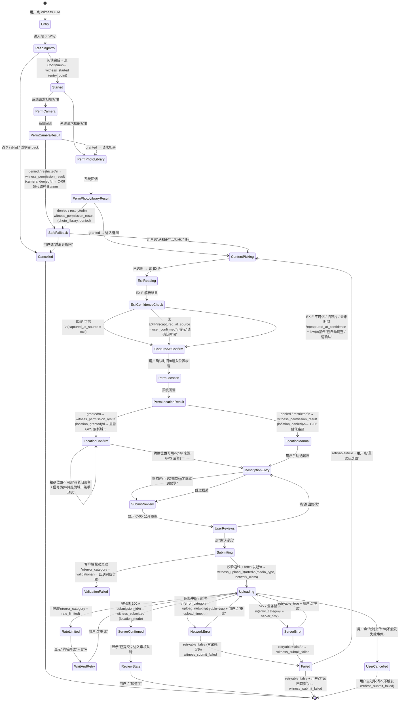

# SEE EARTH V1 · Minimal Witness Flow · 流程图（Web + iOS）

> **作者**：Designer Agent #3（外部 Owner = 您）
> **目标读者**：PM Agent / Web 工程师 / iOS 工程师（first-pass）/ E-P0-09 Contract Owner / E-P0-03 Witness Backend Owner / QA
> **目的**：交付"完整状态矩阵驱动的流程图"，**不是理想成功路径**。每条状态分支都有视觉稿 + 文案 + 字段 + 埋点对应。
> **核心原则**（来自 Brief §4 D-P0-02）：
> 1. 低压力 — 不强制授权；权限拒绝 = 安全替代路径，不是终止
> 2. 可信 — 准确显示数据可信度，不假装审核通过
> 3. 隐私安全 — 公开预览只显示城市级，精确位置仅后台
> 4. 失败不惩罚 — 上传失败可重试；弱网有明确提示；取消是中性动作

---

## 0. 阅读指南

- **Section 1**：6 段流程总览（Web + iOS 一致的主路径）
- **Section 2**：Mermaid 完整状态机（覆盖权限 / 数据可信度 / 上传 / 审核 / 位置降级 5 大状态）
- **Section 3**：Web 端屏幕 + 组件 + 路由映射
- **Section 4**：iOS first-pass 原生导航 + Sheet 映射（**不复用 Web hover 模式**）
- **Section 5**：每段流程的 CTA 矩阵（含失败 / 取消的返回路径）
- **Section 6**：与 D-P0-05 埋点触发点对齐矩阵
- **Section 7**：D-P0-01 LOCKED 边界 / 不修改项

---

## 1. 6 段流程总览（Web + iOS 共享）

> 顺序固定；**每段都有返回 / 跳过 / 终止三条出口**。

```text
┌─────────────────────────────────────────────────────────────────────────┐
│  段 0 │ 入口（Entry）                                                    │
│       │  来源：Homepage Witness CTA / Footer / CityPage Echo 上方 / 分享链接│
│       │  目的：解释 Witness 是什么、为什么需要这些信息                    │
│       │  对应：consent-placement C-03 · event witness_started（点 Continue）│
├─────────────────────────────────────────────────────────────────────────┤
│  段 1 │ 选图 / 拍摄（ContentPicking）                                    │
│       │  触发：相机权限 + 相册权限（如需要）                              │
│       │  失败：权限拒绝 → 安全替代路径（见 §2 状态机）                    │
│       │  对应：event witness_permission_result（camera / photo_library）  │
├─────────────────────────────────────────────────────────────────────────┤
│  段 2 │ 读取并确认 captured_at（CapturedAtConfirm）                      │
│       │  来源：EXIF → 用户确认 / 手动选择日期+时间                        │
│       │  失败：EXIF 不可信 / 旧照片 / 未来时间 → 降级提示                 │
│       │  对应：consistency check → 字段 captured_at_source + _confidence  │
├─────────────────────────────────────────────────────────────────────────┤
│  段 3 │ 位置确认（LocationConfirm）                                      │
│       │  触发：位置权限或手动选择城市                                     │
│       │  失败：精确不可用 / 权限拒绝 → 城市级手动选择                     │
│       │  对应：event witness_permission_result（location）· C-04 文案    │
├─────────────────────────────────────────────────────────────────────────┤
│  段 4 │ 短描述（DescriptionEntry）                                       │
│       │  目的：≤ 1 段，≤ 280 字，可选                                     │
│       │  失败：超长 / 包含禁采内容 → 提示但不阻塞                          │
│       │  对应：与 §1 隐私文案同步（禁采自由文本不进入埋点）                │
├─────────────────────────────────────────────────────────────────────────┤
│  段 5 │ 公开预览 + 隐私再确认（SubmitPreview）                           │
│       │  必须：用户能看见将公开的内容（城市 + 时间 + 描述 + 缩略图）        │
│       │  必须：明确"不会显示"项（精确 GPS / EXIF / 联系方式）             │
│       │  对应：consistency-placement C-05 · 准备 witness_upload_started   │
├─────────────────────────────────────────────────────────────────────────┤
│  段 6 │ 上传 + 结果（Uploading + Result）                                │
│       │  上传中：进度条 + 弱网提示 + 后台中断可恢复                       │
│       │  结果：成功 / 待审核 / 失败可重试 / 失败不可重试 / 用户取消        │
│       │  对应：event witness_upload_started · witness_submitted          │
│       │        witness_submit_failed · C-06 权限拒绝替代路径            │
└─────────────────────────────────────────────────────────────────────────┘
```

**完整闭环成功路径用时目标**：90-180 秒（首次测试者，无口头指导）。

---

## 2. 完整状态机（Mermaid · 覆盖所有 5 大状态类别）



> **关键约束**（来自 trigger-diagram-v1.md §3）：
> - `witness_submitted` 必须由服务端 `submission_id` 落库后触发，**禁止 setTimeout 触发**
> - `witness_submit_failed` 在 retryable=false 时才触发；retryable=true 时重试不重计
> - `UserCancelled` 状态不触发任何失败事件（中性动作）
> - `SafeFallback` 是"权限拒绝"的安全降级，**不是终止**——必须提供回到主流程的路径

---

## 3. Web 端屏幕 + 组件 + 路由映射

### 3.1 路由结构

```text
/witness                                          → 段 0 入口（ReadingIntro）
/witness/photo                                    → 段 1 选图（ContentPicking · 相机或相册 Sheet）
/witness/photo/captured-at                        → 段 2 时间确认（CapturedAtConfirm）
/witness/location                                 → 段 3 位置确认（LocationConfirm / LocationManual）
/witness/description                              → 段 4 短描述（DescriptionEntry）
/witness/preview                                  → 段 5 公开预览（SubmitPreview）
/witness/submitting                               → 段 6a 上传中（Uploading）
/witness/result                                   → 段 6b 结果（ServerConfirmed / Failed / ReviewState）
```

> **路由设计原则**：每段独立 URL，支持浏览器 back / forward；深链 `/witness/preview` 可恢复（sessionStorage 暂存 draft）。

### 3.2 组件 + 状态层映射

| 段 | 路由 | 核心组件 | 复用 LOCKED 组件 | 状态层 |
|---|---|---|---|---|
| 0 入口 | `/witness` | `<WitnessIntroStep>` | `GlobalHeader` (01) · `SectionHeader` (02) | Loading / Default |
| 1 选图 | `/witness/photo` | `<WitnessPhotoStep>` (新) | `HeroMedia` (03) · 焦点圈规范 | Permission (Camera/Photo) · Loading · Error |
| 2 时间 | `/witness/photo/captured-at` | `<WitnessCapturedAtStep>` (新) | `TimeDisplay` (05) · `EchoInput` (12) 的 input 规范 | Default / Warning (EXIF 不可信) / Error |
| 3 位置 | `/witness/location` | `<WitnessLocationStep>` (新) | `LocationMeta` (08) · `LayerIndicator` (09) | Permission (Location) · Loading / Error / City Manual (降级) |
| 4 描述 | `/witness/description` | `<WitnessDescriptionStep>` (新) | `EchoInput` (12) 复用 textarea 规范 | Default / Focus / Typing (EchoInput 已有 5 态) |
| 5 预览 | `/witness/preview` | `<WitnessPreviewStep>` (新) | `HeroMedia` (03) · `TimeDisplay` (05) · `LocationMeta` (08) | Default (审核中可编辑) / Loading |
| 6a 上传 | `/witness/submitting` | `<WitnessUploadingStep>` (新) | 进度条 ≥ 4px 高（移动）· `TimeDisplay` 倒计时 | Uploading / Network Slow / Error |
| 6b 结果 | `/witness/result` | `<WitnessResultStep>` (新) | `HeroMedia` 成功缩略图 | Success (Submitted) / Info (Under Review) / Error (Failed) / Info (Published Later · P1) |

> **复用 LOCKED 组件 14 项中的 7 项**：`GlobalHeader` / `SectionHeader` / `HeroMedia` / `TimeDisplay` / `LocationMeta` / `LayerIndicator` / `EchoInput`（仅借用 input 样式与 5 态，不复用其 submit 语义）。
> **复用 LOCKED 焦点圈规范**：Earth Blue `0 0 0 2px rgba(26, 77, 126, 0.40)`（见 design-freeze-log-v1.md §2.4）。

### 3.3 Web 三档响应式（来自 responsive-rules-v1.md §3.4）

| 段 | Desktop ≥ 1280px | Tablet 768-1279px | Mobile < 768px |
|---|---|---|---|
| 0 入口 | 居中 720px 阅读轴 · 大标题 56-64px Serif | 同 Desktop | 全宽 · 标题 36-40px · 隐私说明在折叠卡片 |
| 1 选图 | 居中模态 + 缩略图预览 | 同 Desktop | **全屏 sheet** · 相机权限弹窗 = 系统原生 · 缩略图全宽 |
| 2 时间 | 居中表单 · 3 字段（日期 / 时间 / 时区）| 同 Desktop | 全宽表单 · 系统原生 date picker / time picker |
| 3 位置 | 居中 · "自动检测" 大按钮 + "手动选择" 次按钮 | 同 Desktop | **全屏 sheet** · "使用当前位置" 大按钮 + "手动选择" 链接 · 手动选时打开城市 picker |
| 4 描述 | 居中 580-680px textarea + 字符计数 | 同 Desktop | 全宽 textarea · 字符计数在下方 · Sticky bottom 继续按钮 |
| 5 预览 | 居中 · 公开预览卡片（max 680px）+ 隐私说明在下方 | 同 Desktop | 全宽 · 预览卡片堆叠 · Sticky bottom [返回] [确认提交] |
| 6a 上传 | 居中 · 进度条（高度 ≥ 4px）+ 弱网提示 + 取消按钮 | 同 Desktop | 全屏 · 进度条在顶部 · 取消按钮在底部 |
| 6b 结果 | 居中 · 大图标（Layer Red 对勾或红叉）+ 简短文案 + 1 个 CTA | 同 Desktop | 全宽 · CTA 全宽按钮 |

**移动特别规则**（来自 responsive-rules-v1.md §3.4）：
- ⚠️ 相机权限拒绝后必须显示跳过路径（C-06 Banner）
- ⚠️ 位置权限拒绝后必须有"手动选择城市" CTA
- ⚠️ 上传进度条在移动端 ≥ 4px 高度
- ⚠️ 段 5 预览的"返回"和"确认提交"按钮必须 Sticky bottom（移动端单手可达）

---

## 4. iOS first-pass 原生导航 + Sheet 映射

> **任务卡强制**："iOS first-pass 原生导航 + Sheet + 权限风格明确，**不复制 Web hover 模式**"（D-P0-02 Acceptance Criteria #7）。
> **来源** Brief §2.2："iOS V1 first-pass 范围：使用 iOS 原生导航、Sheet、权限与上传反馈习惯"。

### 4.1 iOS 导航层级

```text
RootView (TabView · 5 tabs)
├── Today
├── Moment Detail
├── City
├── Unknown
└── Witness
    ├── NavigationStack
    │   ├── Step 0 · IntroView (Why)
    │   ├── Step 1 · PhotoPickerView (PHPickerViewController · 原生)
    │   ├── Step 2 · CapturedAtConfirmView (Form + DatePicker)
    │   ├── Step 3 · LocationConfirmView (CoreLocation + MapKit)
    │   ├── Step 4 · DescriptionEntryView (TextEditor)
    │   ├── Step 5 · SubmitPreviewView
    │   └── Step 6 · UploadingView / ResultView
    └── Action Sheet (权限拒绝时)
```

### 4.2 iOS 原生组件映射

| 段 | Web 组件 | iOS 原生组件 | 理由 |
|---|---|---|---|
| 0 入口 | `<WitnessIntroStep>` | `ScrollView` + `NavigationLink` 推进 | 滑动阅读是 iOS 习惯 |
| 1 选图 | `<WitnessPhotoStep>` | `PHPickerViewController` (相册) / `UIImagePickerController` (相机) · `.sheet` 模态 | iOS HIG：必须用系统 picker，不允许自定义相机 UI |
| 2 时间 | `<WitnessCapturedAtStep>` | `Form` + `DatePicker` (compact/graphical) | iOS HIG：时间用 DatePicker |
| 3 位置 | `<WitnessLocationStep>` | `CoreLocation` + `MapKit` 反查 · `Action Sheet` 选择"使用当前位置 / 手动选择" | iOS HIG：位置权限弹窗是系统原生的，不自定义 |
| 4 描述 | `<WitnessDescriptionStep>` | `TextEditor` + 字符计数（自定义 label） | iOS HIG：长文本用 TextEditor |
| 5 预览 | `<WitnessPreviewStep>` | `List` 或 `VStack` 卡片 · Sticky CTA 用 `.toolbar` | iOS HIG：底部按钮放 toolbar |
| 6a 上传 | `<WitnessUploadingStep>` | `ProgressView` (linear) + `NavigationBar` 取消 | iOS HIG：进度条用 ProgressView |
| 6b 结果 | `<WitnessResultStep>` | `Image` (SF Symbols) + `Text` + Button · 成功/失败 icon | iOS HIG：系统 SF Symbols 优先 |

### 4.3 iOS 权限风格映射

| 权限 | iOS 弹窗 | 拒绝后处理 |
|---|---|---|
| 相机 | 系统 `NSCameraUsageDescription` 弹窗 · 文案 "SEE EARTH 需要相机权限以拍摄实时 Moment" | 系统设置引导（`UIApplication.openSettingsURLString`）· 应用内"从相册选"替代路径 |
| 相册 | 系统 `NSPhotoLibraryUsageDescription` 弹窗 · "SEE EARTH 需要相册权限以选择已拍照片" | 同上 |
| 位置 | 系统 `NSLocationWhenInUseUsageDescription` 弹窗 · "SEE EARTH 需要位置以验证拍摄城市" | 手动选城市（应用内 `CityPickerView`） |

**iOS 与 Web 的关键差异**：

| 维度 | Web | iOS |
|---|---|---|
| 权限弹窗 | 浏览器原生 | iOS 系统原生 · 文案 `Info.plist` 控制 |
| 位置选择 | 浏览器 Geolocation API + Google/Mapbox 反查 | CoreLocation + MapKit 反查（CLGeocoder） |
| 相机 | `<input type="file" accept="image/*" capture="environment">` | `UIImagePickerController` |
| 进度条 | 自定义 div | `ProgressView` (SwiftUI) / `UIProgressView` (UIKit) |
| 上传反馈 | `XMLHttpRequest` 或 `fetch` + progress 事件 | `URLSession.uploadTask(with:from:)` + delegate progress |
| 失败重试 | UI 按钮 | UIAlertController action sheet |
| 取消上传 | 按钮 + AbortController | `URLSessionTask.cancel()` |

> **iOS 不复用 Web hover 模式**：iOS 段 1 选图无 hover；段 3 位置"自动检测 / 手动选择"是分两行的 List cell，不是 hover 切换。

---

## 5. CTA 矩阵（每段 CTA + 目标 + 返回路径 · 含失败 / 取消）

### 5.1 段 0 入口

| 来源 | CTA 文字 (zh-CN) | 目标 | 返回路径 |
|---|---|---|---|
| Homepage Witness CTA (顶部右侧) | "留下一个 Moment" | `/witness` | 浏览器 back → Homepage |
| Homepage Footer Witness 链接 | "成为 Witness" | `/witness` | 浏览器 back |
| CityPage Echo 上方 Witness 链接 | "留下一个 Moment" | `/witness?from=city` | 浏览器 back → CityPage |
| 分享链接 (deeplink) | "进入 Witness" | `/witness` | 浏览器 back |
| **段内 CTA** | | | |
| 阅读到底 | "继续" | `/witness/photo` | 浏览器 back → Homepage |
| 不阅读 | "X" 关闭 | Homepage（无 witness_started） | 浏览器 back |

> **强制规则**：必须滚动到底或停留 ≥ 5 秒才能点"继续"（来自 consent-placement C-03）。

### 5.2 段 1 选图

| 来源 | CTA | 目标 | 失败处理 |
|---|---|---|---|
| 拍照按钮 | "拍一张" | 触发相机权限 → 相机 UI | 权限拒绝 → C-06 Banner "从相册选择" |
| 选图按钮 | "从相册选" | 触发相册权限 → 相册 UI | 权限拒绝 → C-06 Banner "去系统设置 / 取消" |
| 取消 | "← 返回" | `/witness` | — |
| **拒绝后替代** | | | |
| 相机拒绝 + 相册允许 | "从相册选" | 相册 UI | — |
| 两者都拒绝 | "取消并返回" | `/witness` | 触发 `witness_submit_failed(error_category=permission_blocked, retryable=false)`? 否，**用户主动取消不触发失败** |

### 5.3 段 2 时间确认

| 来源 | CTA | 目标 | 失败处理 |
|---|---|---|---|
| EXIF 自动填 | "确认" | `/witness/location` | EXIF 不可信 → 警告 + 用户改 |
| 手动调整 | date/time picker | 表单内编辑 | 旧照片 / 未来时间 → 警告 + 强提示 |
| 返回 | "← 上一步" | `/witness/photo` | — |

### 5.4 段 3 位置确认

| 来源 | CTA | 目标 | 失败处理 |
|---|---|---|---|
| 自动检测 | "使用当前位置" | 系统位置权限弹窗 | 拒绝 → 手动选城市 |
| 手动选择 | "手动选择城市" | 城市 picker (sheet) | — |
| 精确不可用 | 自动降级到手动选 | 城市 picker | 显示"GPS 信号弱，请手动选择" |
| 取消 | "← 上一步" | `/witness/photo/captured-at` | — |
| **拒绝后替代** | | | |
| 位置拒绝 | "手动选择城市" | 城市 picker | — |
| 位置受限 | "去系统设置" | 浏览器/iOS 设置 | — |

### 5.5 段 4 描述

| 来源 | CTA | 目标 | 失败处理 |
|---|---|---|---|
| 写描述 | textarea (≤ 280 字) | `/witness/preview` | 超长 → 提示但不阻塞（硬上限 280 由 maxLength 强制） |
| 跳过 | "跳过（不写描述）" | `/witness/preview` | — |
| 返回 | "← 上一步" | `/witness/location` | — |

### 5.6 段 5 公开预览

| 来源 | CTA | 目标 | 失败处理 |
|---|---|---|---|
| 确认提交 | "确认提交" | `/witness/submitting` → fetch → `/witness/result` | 校验失败 → 回到对应步骤 |
| 返回修改 | "← 返回修改" | 段 4（或段 3 等最后编辑步骤） | — |
| 查看完整隐私说明 | 链接 "完整 Privacy" | `/privacy`（新 tab） | — |

### 5.7 段 6a 上传中

| 来源 | CTA | 目标 | 失败处理 |
|---|---|---|---|
| 取消上传 | "取消上传" | `/witness/result?state=cancelled` | 中性动作，不触发 witness_submit_failed |
| 后台中断 | 系统级提示 | 自动恢复或提示 | — |
| 弱网 | 自动重试（1 次）+ 提示 | 同上 | — |

### 5.8 段 6b 结果

| 结果状态 | CTA | 目标 | 触发事件 |
|---|---|---|---|
| 提交成功（submitted） | "查看城市"（若已发布） | `/cities/:cityId` | `witness_submitted` |
| 提交成功（under_review） | "知道了" | Homepage | `witness_submitted` |
| 失败可重试 | "重试" | 回到段 1 选图 | `witness_submit_failed(retryable=true)` |
| 失败不可重试 | "返回首页" | Homepage | `witness_submit_failed(retryable=false)` |
| 用户取消 | "知道了" | Homepage | 不触发失败事件 |
| 稍后重试（限流） | "稍后再试" + ETA | 等待 → 回到段 1 | 显示限流信息，不重计 |

---

## 6. 与 D-P0-05 埋点触发点对齐矩阵

> **来源**：event-map-v1.md §4 + trigger-diagram-v1.md §3。

| UI 状态 | 触发组件 | 触发事件 | 最小属性 | 服务端确认 |
|---|---|---|---|---|
| 段 0 入口，用户点"继续" | `<WitnessIntroStep>` Continue 按钮 | `witness_started` | `entry_point` (enum) | 否（UI 触发） |
| 系统回调任一权限 | `<WitnessStep>` 状态机 | `witness_permission_result` | `permission_type` / `result` | 否（系统回调） |
| 段 6a 校验通过 + fetch 发起 | `<WitnessUploadingStep>` | `witness_upload_started` | `media_type` / `network_class` | 否（请求发起） |
| 段 6b 服务端返回 submission_id | `<WitnessResultStep>` | `witness_submitted` | `submission_id_hash` (8 位) / `location_mode` | **是** |
| 段 6b 失败不可重试 | `<WitnessResultStep>` Error | `witness_submit_failed` | `error_category` / `retryable` | 否（双源） |
| 用户主动取消上传 | 取消按钮 | **不触发事件** | — | — |

**字段名一致性（与 event-map-v1.md §5 字段名一致性矩阵完全对齐）**：

| 本流程字段 | event-map 字段 | 含义 |
|---|---|---|
| `entry_point` | `entry_point` | 入口枚举（daily12_fab / city_detail / homepage_fab / share_link / deeplink） |
| `permission_type` | `permission_type` | 权限类型（camera / photo_library / location） |
| `result` (permission) | `result` | 权限结果（granted / denied / restricted / not_determined） |
| `media_type` | `media_type` | 媒体类型（photo_camera / photo_library / live_photo） |
| `network_class` | `network_class` | 网络分级（wifi / cellular_4g_5g / cellular_3g / slow_2g / offline） |
| `submission_id` | `submission_id` | 服务端标识（埋点中只发 8 位 hash） |
| `location_mode` | `location_mode` | 位置来源模式（auto_gps_city / manual_city / denied_fallback_manual） |
| `error_category` | `error_category` | 错误分类（validation / upload_network / upload_timeout / server_5xx / permission_blocked / captured_at_invalid / exif_untrusted / rate_limited / duplicate_submission） |
| `retryable` | `retryable` | bool |

---

## 7. D-P0-01 LOCKED 边界 / 不修改项

> **本流程图严格遵循 D-P0-01 已 LOCKED 的 22 项设计**（design-freeze-log-v1.md §1）。
> **不修改项**：

| 类别 | 不修改内容 | 引用 |
|---|---|---|
| **页面** | P0-1 / P0-2 / P0-3 / P0-4 LOCKED 不变 | design-freeze-log-v1.md §3 |
| **路由** | 7 个 P0 路由 + Witness 路由 `/witness` 占位 | sitemap-v1.md §1.1 |
| **Visual Foundation** | VF 1.2（主蓝 #4F8FE0 · Cold Light 12 档 · Earth Blue 焦点圈） | design-freeze-log-v1.md §2.1 |
| **组件** | 14 组件 LOCKED · Witness 仅复用样式规范，不复用 submit 语义 | design-freeze-log-v1.md §6 |
| **三套 Layer** | 仅 Blue / Yellow / Red · 不增加第四套 | design-freeze-log-v1.md §2.4 |
| **5 City States** | 不变 | design-freeze-log-v1.md §5 |
| **响应式三档** | Desktop ≥ 1280 / Tablet 768-1279 / Mobile < 768 | responsive-rules-v1.md §1 |
| **Brief §6 不做项** | 不做社交 / 不做账户 / 不做推荐 / 不做 Native Android / 不做 4th Layer | Brief §6 |

**本流程图新增视觉方向数量 = 0**。仅在 Witness 路径上复用 LOCKED 组件样式 + 焦点圈 + 字号规范。

---

## 8. 自验收（Acceptance Criteria 打勾）

- [x] **首次测试者无需口头指导可完成提交** — 6 段流程每段都有明确 CTA 文案（见 §5）
- [x] **权限拒绝后存在安全可理解的替代路径** — 状态机 `SafeFallback` 节点提供"从相册 / 手动选城市 / 取消并返回"（见 §2）
- [x] **公开预览中不存在精确坐标 / 原始 EXIF / 推断住址** — 段 5 预览仅显示城市 + 时间 + 描述 + 缩略图（见 §1 + §5.6）
- [x] **用户在最终提交前能看见将被公开的内容** — 段 5 公开预览是强制步骤（见 §1 + §5.6）
- [x] **全部状态都有视觉稿** — 见 `state-matrix-v1.md` 配套；本流程图给出每段组件 + 状态层
- [x] **前端字段与 API 字段一一对应** — 见 `api-field-mapping-v1.md` 配套
- [x] **iOS first-pass 原生导航 + Sheet + 权限风格明确，不复制 Web hover 模式** — 见 §4 iOS 完整映射
- [x] **隐私文案与 E-P0-05 位置隔离原则一致** — 见 `copy-final-v1.md` C-03~C-06 配套
- [x] **与 D-P0-05 trigger-diagram §3 状态机对齐** — 见 §2 完整状态机与 §6 埋点对齐
- [x] **与 D-P0-05 event-map §5 字段名一致性矩阵对齐** — 见 §6 字段名表

---

**End of flow-diagram-v1.md · D-P0-02 子产物 1/5**
